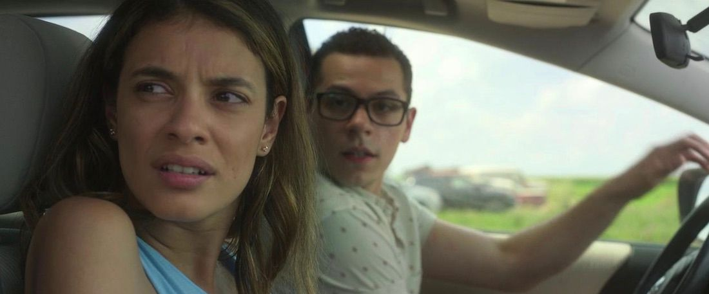
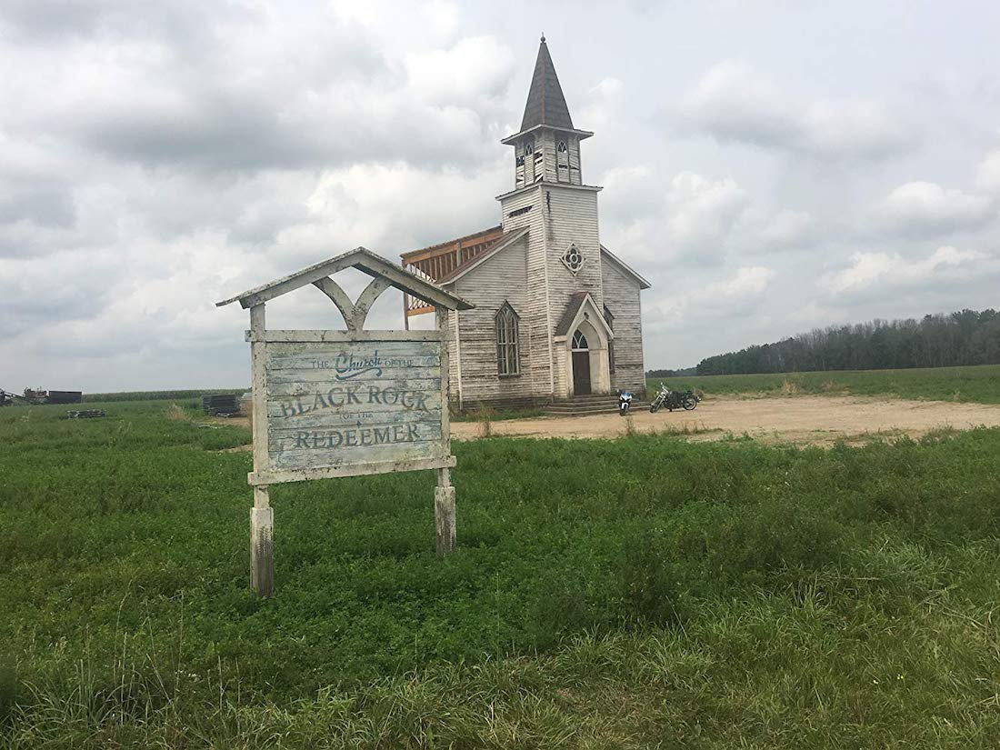
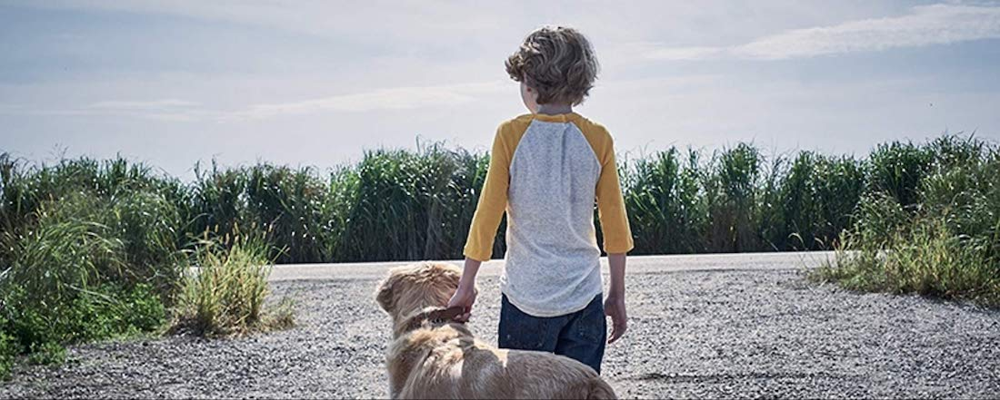
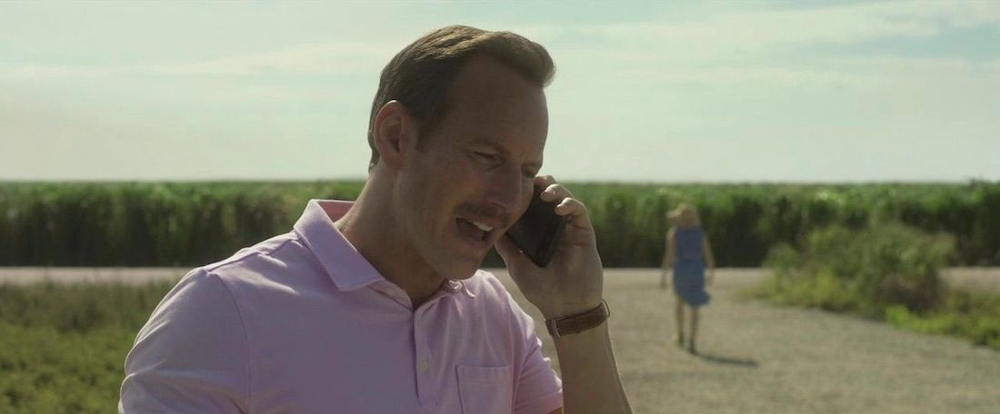
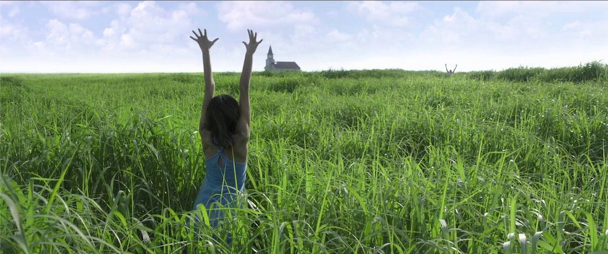

**Año** : 2019  
**Director** : Vincenzo Natali  
**Guión** : Vincenzo Natali, Stephen King (esta basado en su libro)  
**Plataforma** : Netflix
**Imdb** : [5,4](https://www.imdb.com/title/tt4687108/)

Deben haber muchas películas basadas en libros de Stephen King en Netflix, pero en **In the Tall Grass** se puede ver un toque de calidad similar a [1922 (2017)](/1922/), la cual estaba bastante bien para ser _una película original de Netflix_ y si eso le sumamos que es dirigida por Vicenzo Natali, un director conocido por películas como **Cube** y **Splice** ( a muchos no les gustan, pero a mi si) y por participar como director de algunos episodios de grandes series como **Hannibal** , **Westworld** o **Wayward Pines** me decidí a verla y no me arrepentí.

### En la Hierba Alta

La película cuenta la historia de una joven embarazada llamada Becky (Laysla De Oliveira) y de su hermano Cal (Avery Whitted) quienes van viajando por la típica carretera norteamericana que suele estar rodeada por campos infinitos de maíz y otras hierbas. En un momento Becky se siente fatigada por el viaje y paran junto a una antigua iglesia llamada "Iglesia de la Roca Negra del Redentor", donde se ven varios autos aparcados frente a ella.

Becky se baja del vehículo y escucha un niño que pide ayuda de entre la espesa hierba y también escucha a una mujer que le dice al niño que no llame a nadie... lo que aumenta su intriga y la preocupación por el niño, por lo que deside a entrar en la hierba alta junto a Cal. A partir de aquí todo se vuelve complicado ya que las cosas parecen moverse de forma extraña dentro de la hierba y el tiempo y espacio corren de forma random desorientandolos a los pocos minutos de haber entrado.

### Historias

La película nos cuenta varias tramas que se juntan y crean una propia, por un lado tenemos a Becky y Cal que entraron a buscar al niño, por otro lado tenemos a Tobin (el niño perdido) quien entro a la hierba siguiendo a su perro Freddy (tiene la culpa de todo) y a su vez fue seguido por sus padre, Ross (Patrick Wilson) y Natalie (Rachel Wilson) y por ultimo tenemos a Travis, quien entra a buscar a Becky dando inicio al segundo acto de la peli. La motivación y el pasado de cada uno se desvelan dentro de la hierba y dejan en evidencia oscuros secretos y reprimidos instintos que van dando rostro al laberinto en movimiento en que se han adentrado.

Hasta aquí podemos hablar sin **spoilers** ya que creo que es una película que hay que ver y contar más cosas arruina la experiencia.

### y que más?

Estuve buscando info y creo que las cosas que no se explican en el film tampoco se explican en el libro xD, pero hay algunas que son simplemente nombradas en la cinta y que tienen un trasfondo (como la iglesia y los autos estacionados).  
Debo destacar una secuencia muy extraña que me recordo de sobremanera a lo que hace Aronofsky en ¡Mother! (2017) por lo surrealista de los colores y el alto contraste que se usa ( y otras cosas más ).

### Redención

El film se centra en algo simple, como muchas adaptaciones de King, en este caso el secreto es la **redención** y la posibilidad de arrepentirse y remediar algo que hicimos en el pasado (?). **In the Tall Grass** es una película llena de giros y vueltas que hay que ver concentrado y que da para conversar mucho, lo que **siempre** es bueno.

**EXTRA** : el final del libro es muy diferente

Disponible en <a href="https://www.netflix.com/title/80237905" target="_blank">Netflix</a>

