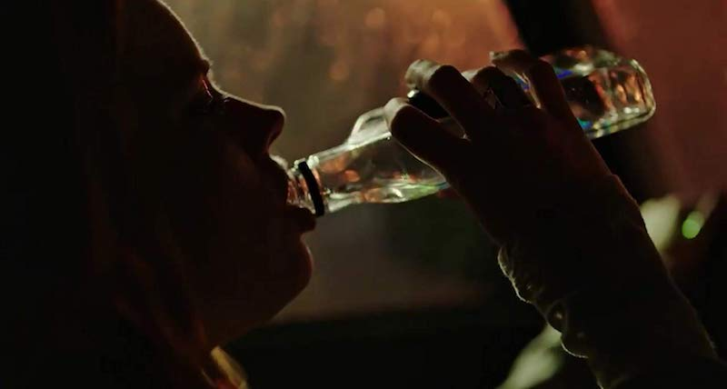
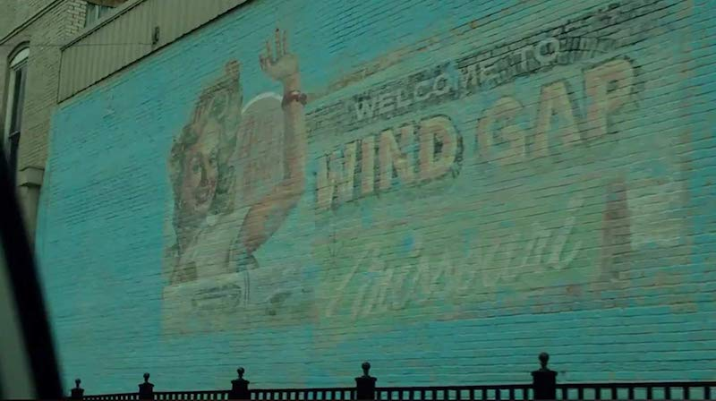
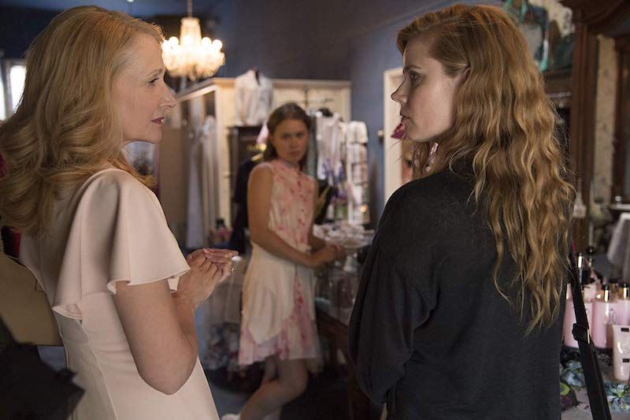
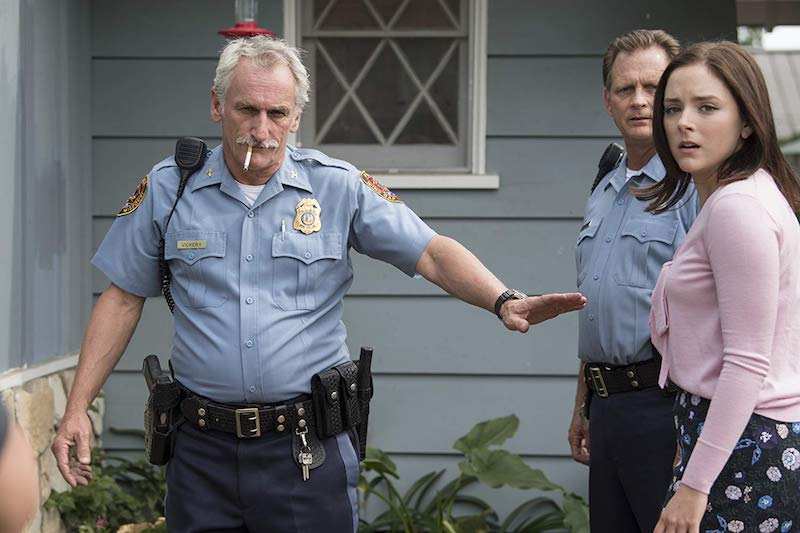
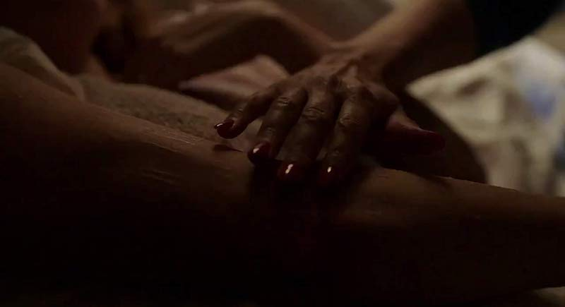
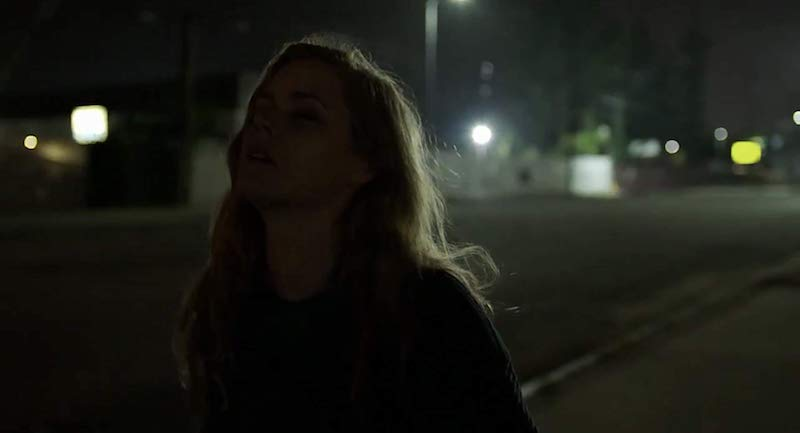
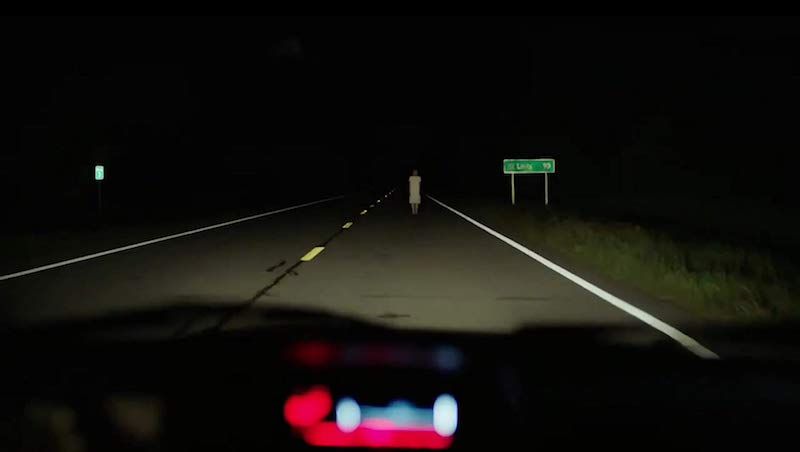
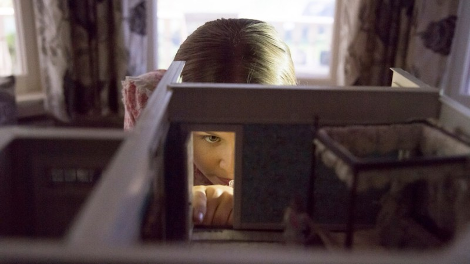
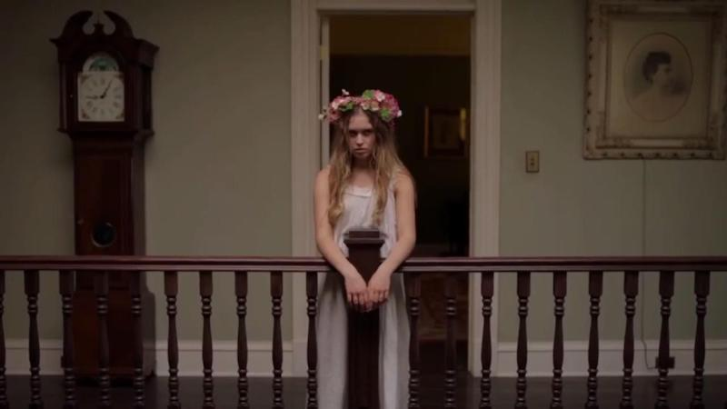

**Primer episodio** : 8 de julio de 2018  
**Último episodio** : 26 de agosto de 2018  
**Cantidad de episodios** : 8  
**Creador** : Marti Noxon  
**Basado en** : Sharp Objects de Gillian Flynn  
**Imdb** : [8.2](https://www.imdb.com/title/tt2649356)

<figure class="kg-card kg-embed-card kg-card-hascaption">
    <iframe width="560" height="315" src="https://www.youtube.com/embed/DgljcMqPG98" frameborder="0" allow="accelerometer; autoplay; encrypted-media; gyroscope; picture-in-picture" allowfullscreen></iframe>
    <figcaption>Sharp Objects</figcaption>
</figure>

Serie de HBO basada en el libro de Gillian Flynn del mismo nombre que cuenta la historia de Camille Preaker (Amy Adams) una periodista que debe volver a su pueblo de infancia, Wind Gap, para investigar la muerte de algunas niñas y las extrañas condiciones en que fueron halladas, y de paso enfrentarse con viejos fantasmas de su pasado, con la mala fama que la precede desde su adolescencia y con el triste recuerdo de su hermana fallecida cuando pequeñas.

### El regreso

El regreso al pueblo de infancia siempre es difícil, más aún si fuiste una chica problemática, con fama de mujerzuela entre las demás féminas del pueblo, hija de la familia más rica y hermana de una hermosa joven que murió en las peores condiciones posibles, todos hechos que la atormentaron al punto de la locura y que dejaron huella en su cuerpo marcado por agujas y cuchillos que describen hechos y conceptos que marcaron (de manera literal) la vida de una solitaria y alcohólica Camille.

### Wind Gap

El pueblo de Wind Gap en sí es un personaje más, un personaje racista hijo del ejercito confederado y gobernado por la familia que tiene el negocio más grande y que da trabajo a (casi) todo el pueblo, una enorme planta de crianza de cerdos que está a cargo de la madre de Camille llamada Adora Crellin, interpretada por una increible Patricia Clarkson.

Wind Gap me recuerda a las ciudades que hay en las historias de Stephen King, ya que está lleno de lugares y personas únicas y peculiares que dan lugar a TODO lo que se imagine. Un jefe de policía que representa a la antigua fuerza de la ley que cuida a sus coterraneos, un bar donde todos se conocen, un grupo de mujeres que solo quiere comentar las desgracias de los demás para sentir que las propias no son tan importantes y una nueva camada de jóvenes que parece querer repetir la historia de sus predecesoras recorriendo las abandonadas calles en patines y con cortos short. Dentro de este ultimo grupo se encuentra Amma Crellin (Eliza Scanlen), hermanastra de Camille, quien estaba relacionada con una de las chicas desaparecidas y que ve en Camille una figura _cool_ a imitar.

### La casa Preaker

El decorado de la casa es genial, a momentos se siente como un film de casa embrujada, donde los fantasmas del pasado y el presente chocan y las paredes guardan muchos secretos que solo sabremos nosotros. La gran cantidad de paralelismos, la importancia de los cuadros y el choque del mundo de las drogas y los excesos junto con la vida confederada tradicional y la existencia de una sola persona negra que resulta ser la sirvienta, descolócan y a la vez capturan de forma magnética a la pantalla, que baila de manera perfecta con la música, que no solo acompaña, sino que tiene un motivo y una justificación para ser tan importante en la vida de Camille.

Más o menos la mitad de la serie transcurre en la casa, es un símbolo de contención, de secretos, mentiras, traiciones y ojos que se cierran a voluntad para proteger o ignorar lo que realmente pasa, pero a pesar de toda esa oscuridad, esos mismos pasillos y habitaciones fueron el refugio de buenos y felices días de Camille junto a su pequeña hermana cuando eran pequeñas.

### Lento, pero seguro

La historia avanza lento y se cocina a fuego bajo, lo que nos genera una ansiedad brutal capitulo a capitulo y que muestra lo buena que es la historia y lo excelente que son Amy Adams y Patricia Clarkson para transmitir lo que sienten sin palabras. Al igual que ellos hay 3 personajes que destacan mucho, Eliza Scanlen como la pequeña hermanastra de Camille que hace las veces de niña rebelde a escondidas de sus sobreprotectores padres. Matt Craven como el jefe de policía que vive una rutina diaria y que oculta secretos (al igual que todos en el pueblo) y Elizabeth Perkins como Jackie O'Neill, la mujer alcohólica, lujuriosa y que hará de todo por mantener su estatus, sin importar sus valores. El resto del elenco igual es muy bueno, orbítan en torno a la protagonista susurrando cosas y creando situaciones que se tambalean entre excesos y mentiras y que hacen teorizar acerca de quien es el asesino y que lo motiva. Cada capitulo revela una situación que marco a Camille, pero que entrega información en relación a las niñas muertas como la leyenda de la Mujer de Blanco, los abusos por parte de las personas con mas dinero, la información que la policía oculta y el abuso de drogas y alcohol por parte de la juventud de Wind Gap.

### Recomendada?

**Absolutamente** , la dirección es genial al igual que las actuaciones, podemos ver entre líneas cosas que no son explícitas y sentir que hay miradas que dicen mucho y que a veces la motivación para hacer algo va más allá del bien y el mal. La horrorosa forma en que se encuentran los cadáveres y los oscuros secretos de cada habitante de Wind Gap me hacen pensar que si hubiese sido dirigido por David Fincher estaríamos frente a una obra tan buena como Gone Girl o Mind Hunter. Que buena serie, de lo mejor de este último tiempo.

### Fantasmas, sombras y patines

Para terminar, una de las cosas que más me gusto fue el recurso del _flashback_ y las visiones de Camille... que grato ver ese tipo de cosas que te hacen pensar si es real o es algo que imagína ebria o a causa de sus traumas... excelente!

**Extra** : Lean el libro, hay cosas, sobre todo al final, que se explican de manera detallada en los párrafos escritos por Flynn y que te dejaran mas perturbado aún al saber que la verdad escondía más historias y detalles aún peores.
