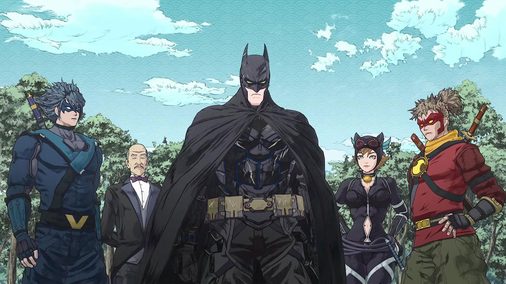
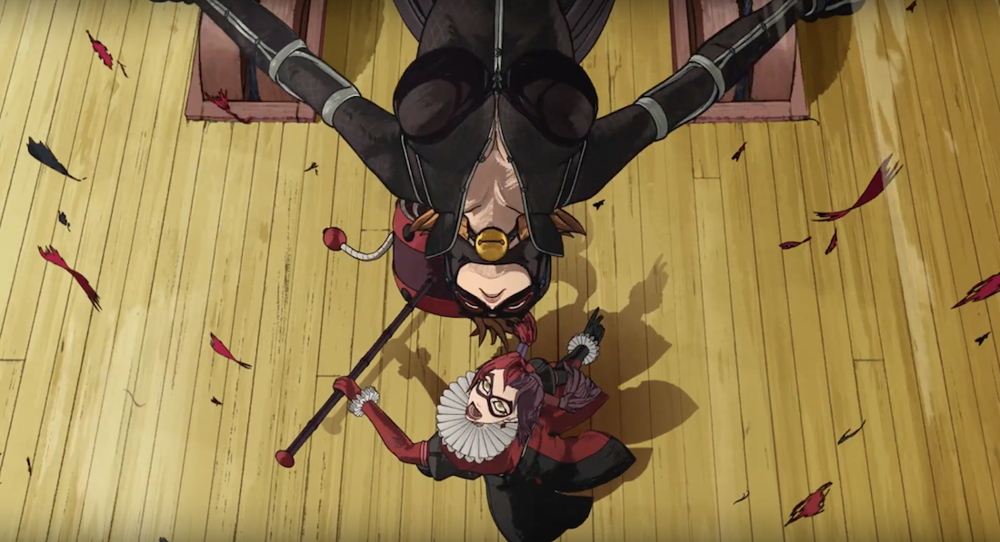
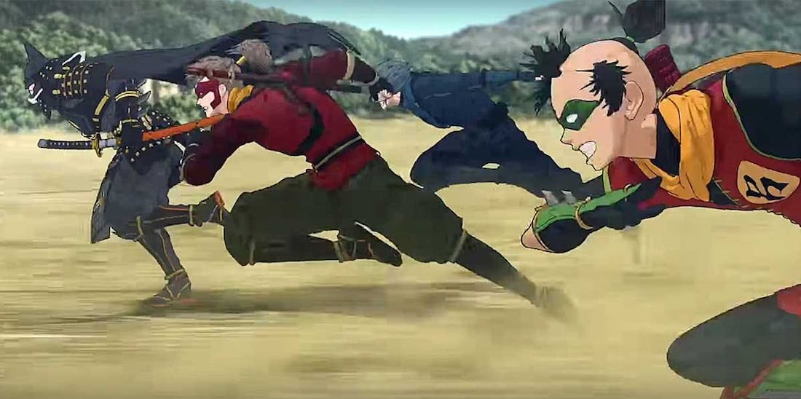
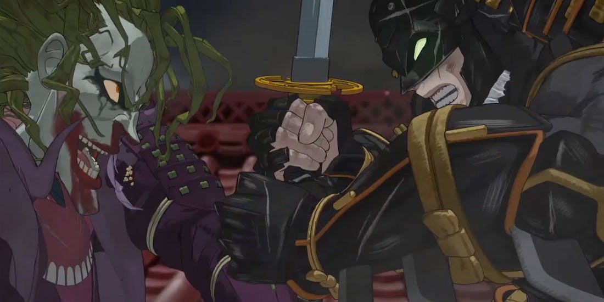

**Fecha de estreno**: 24 de abril de 2018  
**Director**: Junpei Mizusaki  
**Música compuesta por**: Yugo Kanno  
**Idiomas**: Idioma japonés, Idioma inglés  
**Productoras**: Warner Bros. Animation, DC Entertainment  
**Imdb** : [5,6](https://www.imdb.com/title/tt7451284/)

<figure class="kg-card kg-embed-card kg-card-hascaption">
    <iframe width="560" height="315" src="https://www.youtube.com/embed/CwPFxcefpdU" frameborder="0" allow="accelerometer; autoplay; encrypted-media; gyroscope; picture-in-picture" allowfullscreen></iframe>
    <figcaption>Batman Ninja</figcaption>
</figure>

Mediante un dispositivo para viajar en el tiempo, Gorila Grodd transporta a varios villanos de Gotham al Japón feudal, en algo que parece un accidente provocado cuando Batman trata de evitar que usen el artefacto, lo que también lo transporta a él, pero llegando 2 años después...

Al llegar Batman a este mundo de Ninjas y Samurais nota que Japón está dividida en 5 reinos que luchan por conquistarse mutuamente y que son liderados por cada uno de los villanos transportados por Grodd: el Pingüino, Hiedra Venenosa, Deathstroke, Dos Caras y el Joker, siendo este último el más próximo a lograr la unión de todo Japón.

Batman, junto a todos los Robin y a un culto ninjas que cree en una leyenda/profecía de un salvador hombre murciélago, enfrentan a los villanos, sus ejércitos y sus robots gigantes, ya que Batman Ninja tiene toooodos los ingredientes del anime, dibujo con muchos detalles, paisajes dignos de cuadros, texturas diferentes para algunas secuencias, sentido del humor nipón, mechas gigantes y unas secuencias de acción excelentes, lo que hace una película e historia única para el enmascarado de Gotham y que mantiene la esencia de sus personajes a pesar de posicionarse en una historia de Mekas vs Monstruos Gigantes hechos con animales(?).

Lo que más me gusto fue por mucho el diseño de los personajes, tanto en su versión original, como en lo que se convirtieron con el tiempo en el Japón feudal, destacando de sobremanera el Batman (actual como el de Japón), el Joker, Harley Quinn y Catwoman.

**Batman Ninja** es una película recomendada si te gustan las pelis animadas, pero ojo, definitivamente no es para todos los públicos. El lado Anime podría resultar aburrido, tonto o incluso fuera de lugar para algunas personas, aun así, siempre es bueno darle la oportunidad a historias nuevas que se salen del canon y nos sorprenden con un festival de colores y gráficas de tan alto nivel que en otras épocas serían acusadas de causar epilepsia.

Veala **si o si**, tiene muchas cosas que valen la pena... y las que no las perdonamos igual, al final es una película que busca entretener... y tiene a Batman :D

Disponible en <a href="https://www.netflix.com/title/80244455" target="_blank">Netflix</a>

