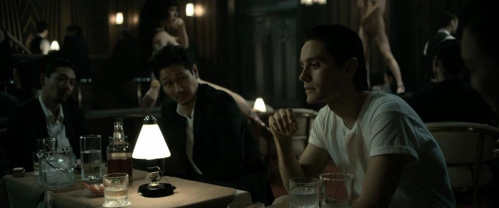
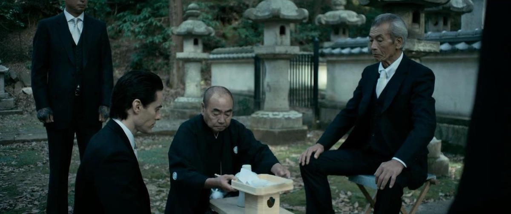
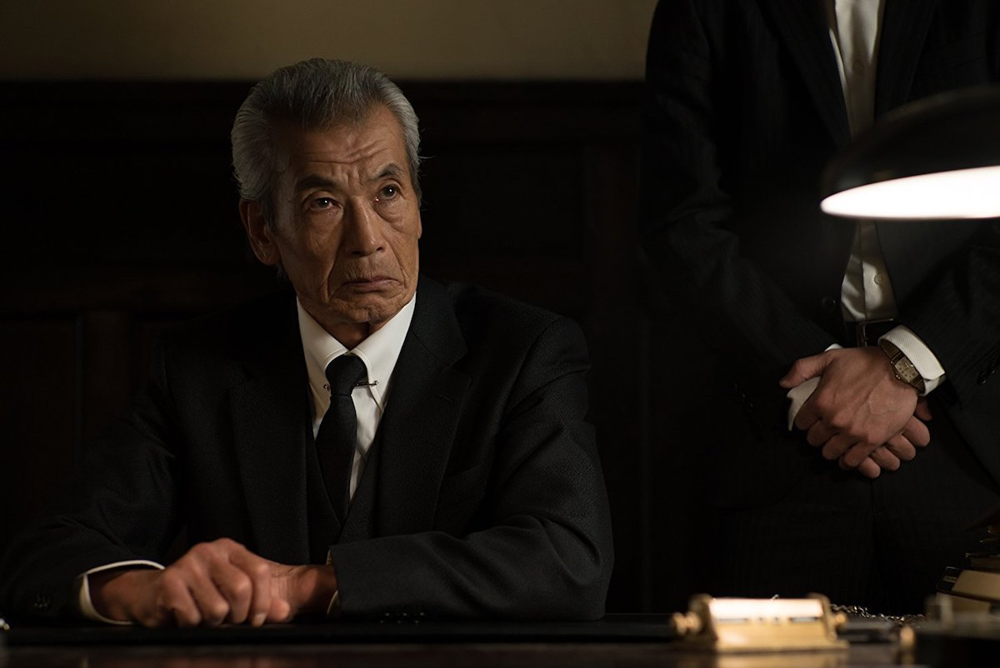
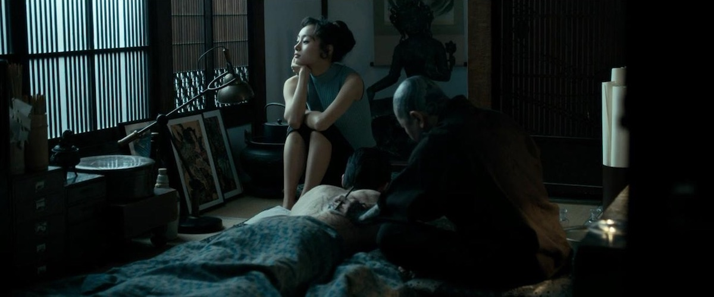

**Año**: 2018  
**Director**: Martin Zandvliet  
**Música compuesta por**: Sune Martin  
**Imdb** : [6.3](https://www.imdb.com/title/tt2011311/)

<figure class="kg-card kg-embed-card kg-card-hascaption">
    <iframe width="560" height="315" src="https://www.youtube.com/embed/nP2-S6_pL-U" frameborder="0" allow="accelerometer; autoplay; encrypted-media; gyroscope; picture-in-picture" allowfullscreen></iframe>
    <figcaption>The Outsider</figcaption>
</figure>

**The Outsider** es la historia del prisionero de guerra norteamericano, **Nick Lowell** (Jared Leto), que tras salir en libertad es ayudado por un líder Yakuza llamado **Kiyoshi** (Tadanobu Asano) a quien conoció en prisión y quien quedó en deuda de honor con Nick. Tras poco tiempo en libertad Nick demuestra una y otra vez su lealtad a Kiyoshi con lo que se gana el derecho a formar parte de la familia Yakuzas y convertirse en hijo de **Akihiro** (Min Tanaka) líder de la familia (que regala la mejor actuación de la película), a pesar de que no todo el clan confía en él.

La personalidad de Nick calza de manera perfecta dentro del séquito de Yakuzas, ya que se muestra como una persona calmada y casi inexpresiva, pero que de un momento a otro explota de forma violenta. A pesar de no saber hablar Japones es capaz de convivir y compartir con el resto de su nueva familia, principalmente con Kiyoshi. 
Con el pasar de la historia Nick se enamora de **Miyu** (Shioli Kutsuna), hermana de Kiyoshi, relación que genera problemas al interior de la familia Yakuza y que define el último tercio del film y sirve de detonante para los momentos más altos del mismo.

### Japón

La historia transcurre en una época donde Japón está en plena reconstrucción tras el lanzamiento de las bombas y aun se ven soldados Norteamericanos deambulando por las sucias calles de las ciudad, regalandonos, gracias a una excelente fotografía, un Japón crepuscular lleno de amaneceres y atardeceres grises que decoran amplias tomas de la ciudad y los puertos, con noches repletas de bares donde abundan los recursos comunes de la mafia y las luchas de ego y respeto están a la orden del día. **Gracias** por esto.

### En conclusión

La película se toma su tiempo en contarnos todo y la siento como una especie de película noir oriental (no se si eso existe como tal), y quizás por eso es acusada de aburrida. Creo que es un film diferente, no es John Wick, se toma su tiempo y eso está bien. Luego de verla investigue un poco y encontré que Takashi Miike y Tom Hardy eran la dupla inicial para este proyecto como director y protagonista... creo que ahí habría sido una obra maestra. A pesar de esto, **recomendada!**

Disponible en <a href="https://www.netflix.com/title/80152434" target="_blank">Netflix</a>

