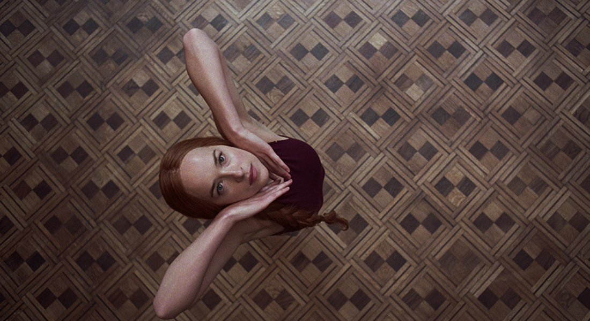
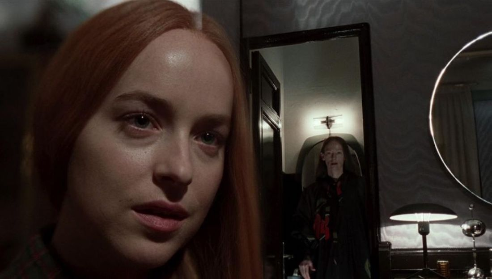
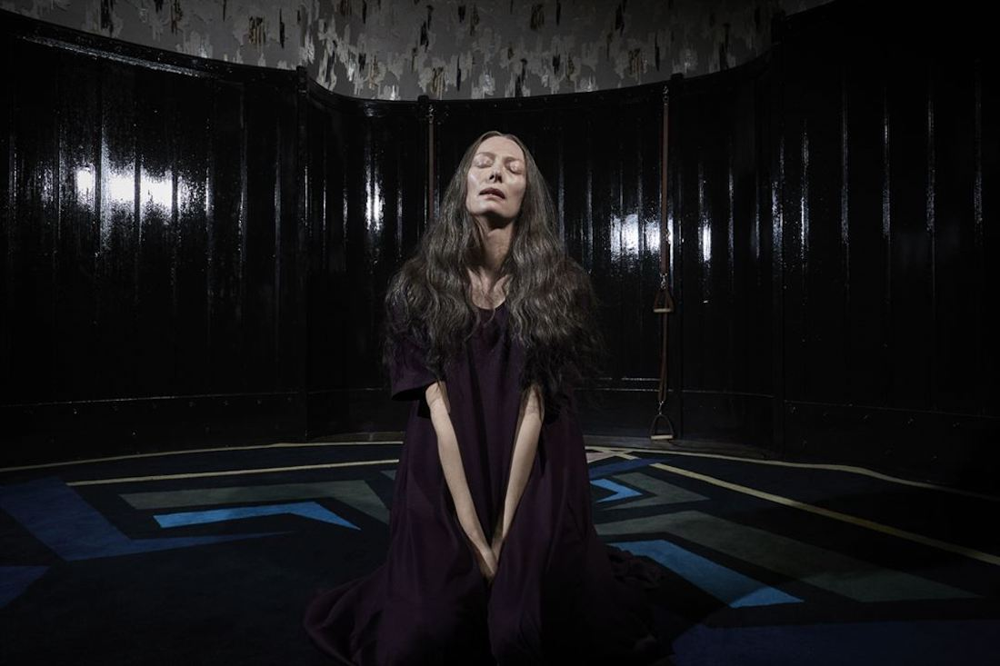
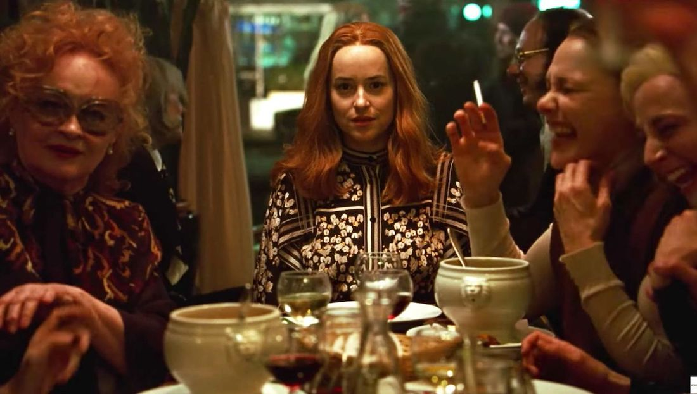
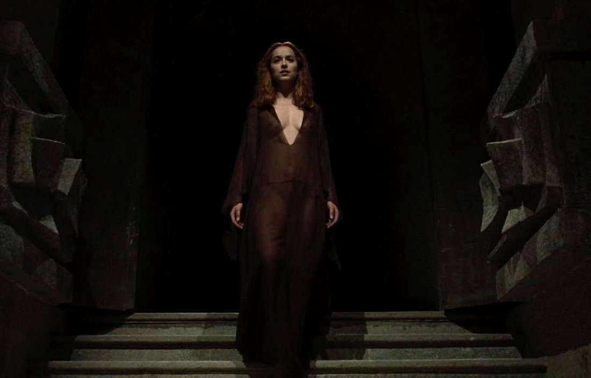
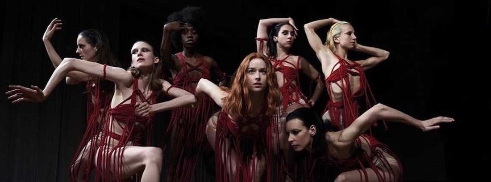

**Año** : 2018  
**Director** : Luca Guadagnino  
**Imdb** : [6.8](https://www.imdb.com/title/tt1034415)

<figure class="kg-card kg-embed-card kg-card-hascaption">
    <iframe width="560" height="315" src="https://www.youtube.com/embed/zDGPnrYiS50" frameborder="0" allow="accelerometer; autoplay; encrypted-media; gyroscope; picture-in-picture" allowfullscreen></iframe>
    <figcaption>Suspiria</figcaption>
</figure>

Película de terror orquestada por Luca Gudanino quien busca homenajear a Dario Argento y su Suspiria original de 1977, situando a los mismos personajes en el mismo lugar, pero con un camino a recorrer por los protagonistas un tanto distinto al original y con aristas diferentes al clásico de terror del 77.

Suspiria es la historia de Susie (Dakota Johnson), una joven norteamericana que viaja hasta Alemania para audicionar y con suerte quedar en la prestigiosa escuela de danza Tanz, dirigida por un cerrado grupo de mujeres que llevan años a cargo del establecimiento. Desde un comienzo Susie deslumbra por su alta capacidad para interpretar la música y capturar de forma hipnotica al publico, cosa que la aparente líder, Madame Blanc (Tilda Swinton), no dejará pasar y tratará de sacar el mayor provecho posible a la novata.

A medida que Susie avanza en el escalafon de bailarinas, conoce a Sara (Mia Goth), de quien se hace amiga de inmediato y junto a la cual se disponen a investigar la extraña desaparición de una ex-alumna y amiga de Sara, Patricia (Chloe Grace Moretz). Esta investigación las llevara a arriesgar demasiado, y en el caso de Susie, a comprender un poco más quién es realmente y cual es su misión ahí.

En el clásico del 77, Susie (Jessica Harper), conversa con un siquiatra y con un experto en sectas y cosas por el estilo en una secuencia precisa y muy breve, en esta versión, Luca Gudanino creo un personaje que hace las veces de estos 2, el Dr. Klemperer, que toma un rol muy protagonico dentro de la historia, ya que desafortunadamente la version de 2018, muestra todo, no deja textos entre lineas y sobre explica cada cosa que ocurre (muchas a traves de este personaje), por ejemplo el titulo de la película en la version original sólo se ve escrito en un diario, acá lo nombran y explican muchas veces por si no quedo claro a la primera.

### La Madre

Lo mejor es lejos el elenco (ignorando a Grace Moretz), tanto Dakota Johnson como Tilda Swinton deslumbran en cada una de sus escenas y dan peso a una historia que mantiene la intriga y el terror hasta el ultimo minuto. Lo otro bueno es la cinematografía, sobre todo en la coreografía del Volk y la escena de climax del ultimo acto (que no existia en la versión original).

Creo que es una buena nueva version del film original, pero siento que se esfuerza demasiado por explicar todo, aveces es bueno respetar al espectador y darle espacio para crear propias conjeturas en base a lo que ve y regalarle de paso conversaciones en torno a ello. Una película que se ve muy bien y qué deja claro que Dakota Johnson es una muy buena actriz. Tremenda Tilda Swinton, con ella basta como motivo para ver el film.

**EXTRA** : Me gusto, pero me quedo con la de 1977.

<!--kg-card-end: markdown-->
