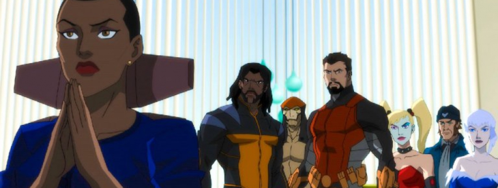
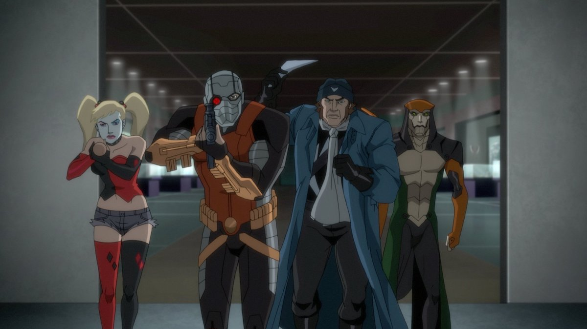
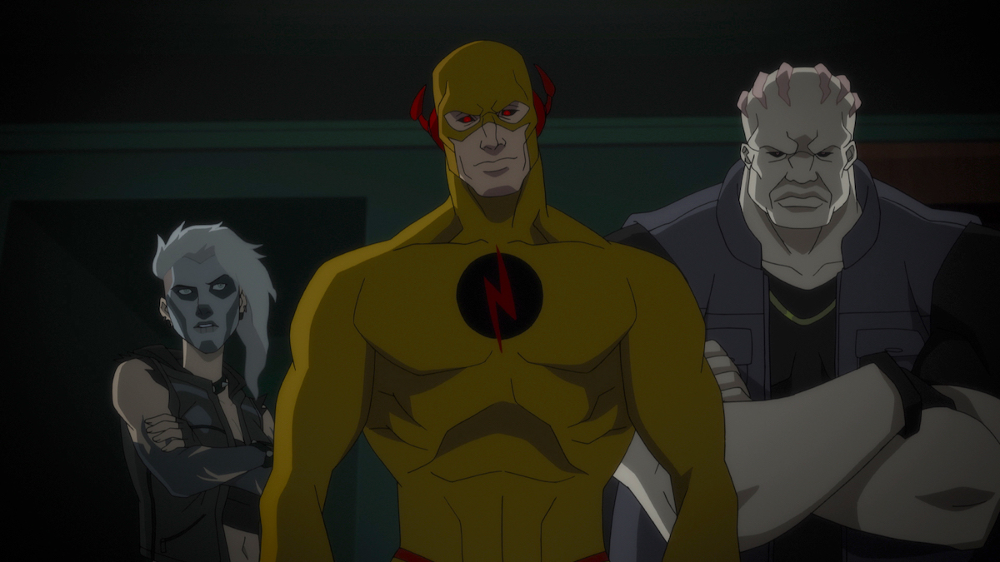

**Año**: 2018  
**Director**: Sam Liu  
**Basada en**: Suicide Squad; de Robert Kanigher, Ross Andru y John Ostrander  
**Música compuesta por**: Robert Kral  
**Imdb** : [7.0](https://www.imdb.com/title/tt7167602)

<figure class="kg-card kg-embed-card kg-card-hascaption">
    <iframe width="560" height="315" src="https://www.youtube.com/embed/EPZZvk-wbGE" frameborder="0" allow="accelerometer; autoplay; encrypted-media; gyroscope; picture-in-picture" allowfullscreen></iframe>
    <figcaption>Suicide Squad Hell to Pay</figcaption>
</figure>

Película animada de DC centrada en una nueva misión del extraño grupo de villanos que trabajan para **Amanda Waller** (que ahora es delgada). La historia existe en la misma línea narrativa de Flashpoint Paradox (2013) e incorpora en el universo animado DC a muchos personajes que no habíamos visto hasta ahora como Bronze Tiger, Copperhead, Blockbuster, Banshee, Vandal Savage y más, lo malo es que dejo claro que la anterior cinta animada de Suicide Squad es una obra independiente ( 2014 - Batman: Assault on Arkham ) y que esto está más vinculado a las demás películas DC e incluso cuenta con un lejano aire a la película de Suicide Squad de 2016.

En esta entrega la misión encomendada por Waller tiene un trasfondo personal, ya que envía al extraño equipo a buscar algo que ella necesita, pero no son los únicos tras **_esto_**, un grupo de villanos formado por Zoom, Blockbuster(?) y Banshe también está en movimiento, y para cerrar tenemos una tercera facción liderada por **Vandall Savage**.

La animación es muy buena por lo que no entiendo el motivo para intercalar escenas (muy mal) hechas por computador y tiene grandes secuencias de acción y peleas cuerpo a cuerpo. Me gustó mucho el vínculo que hacen con lo contado en otros filmes, por ejemplo (spoiler mínimo) el comentario en relación con Waller 'Desde que bajo de peso' y otras cosas que resultan muy bien.

Estéticamente prefería el diseño de los personajes de Assault on Arkham, Deadshot y Harley cambiaron demasiado (y no para bien), el diseño de Banshee me agrado, mejoro y no se ve como una mujer tan mayor, al igual que Vandall Savage, que se ve fuerte y no como una especie de pirata a destiempo.

Muy recomendada si eres fan de las adaptaciones animadas DC más serias, no supera a **Justice League War** (2014) ni a **Batman vs Robin** (2015), pero está mucho mejor que Batman and Harley Queen (2017), incluso diría que al nivel de **Teen Titans: The Judas Contract** (2017).

