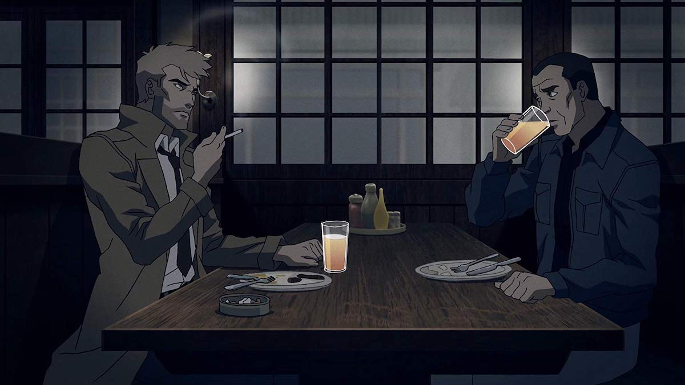
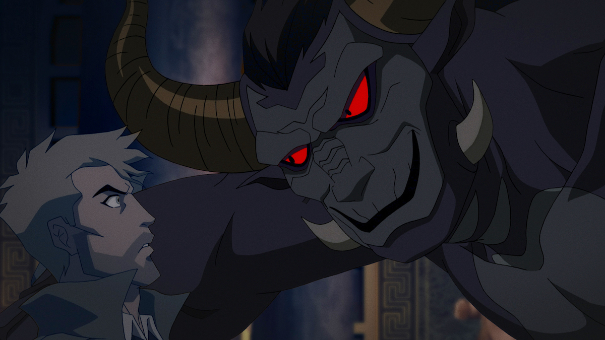
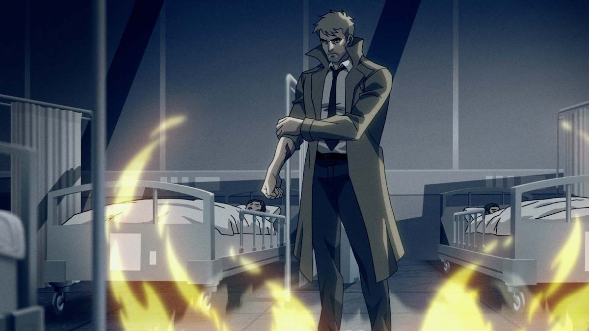

**Creador** : Doug Murphy  
**Red** : The CW  
**Imdb** : [7.5](https://www.imdb.com/title/tt9177882/)

<figure class="kg-card kg-embed-card kg-card-hascaption">
    <iframe width="560" height="315" src="https://www.youtube.com/embed/TGjDryjvBes" frameborder="0" allow="accelerometer; autoplay; encrypted-media; gyroscope; picture-in-picture" allowfullscreen></iframe>
    <figcaption>Constantine: City of Demons</figcaption>
</figure>

**Constantine: City of Demons The Movie** es la recopilación de los capítulos de la serie animada lanzada con el mismo nombre, que nos cuenta una historia del detective de lo paranormal John Constantine con un guión de lujo y una animación característica de DC que coquetea con el dibujo visto en la serie animada de Spawn.

### L.A. City of Demons

City of Demons trata acerca de cómo Jhon busca rescatar a la hija de su amigo de toda la vida, Chas Chandler, de las garras de un poderoso demonio que necesita algo de Constantine y que como moneda de cambio usara a la pequeña niña, mientras se enfrenta al constante tormento de la muerte de una chica por su falta de conocimientos en las artes ocultas y su eterna agonía en el infierno.

El debate moral, siempre presente en torno al personaje, lo lleva a investigar y a aliarse a extraños seres y antiguos demonios, incluso a frecuentar una franquicia del infierno en la Tierra, con el objetivo de rescatar a la hija de Chas, donde su única aliada será una extraña y particular entidad conocida como **Asa the Healer** , la cual cuidará el cuerpo de la niña mientras John lucha por su alma.

### Excelente historia

La historia es increíble, con los recursos adecuados podría haber sido una gran película live action y claramente debe ser un cómic buenísimo. Excelente película animada, **recomendadisima**, eso si, sólo para adultos, ya que esta llena de cadaveres, traseros y desmembramientos.

**Extra** : la voz de John Constantine es dada por Matt Ryan, quien hizo la serie del personaje, donde por culpa de la censura (sin escenas para adultos y sin fumar) se limitó la creatividad y el universo de un personaje muy atractivo y con mucho para contar.

<!--kg-card-end: markdown-->
