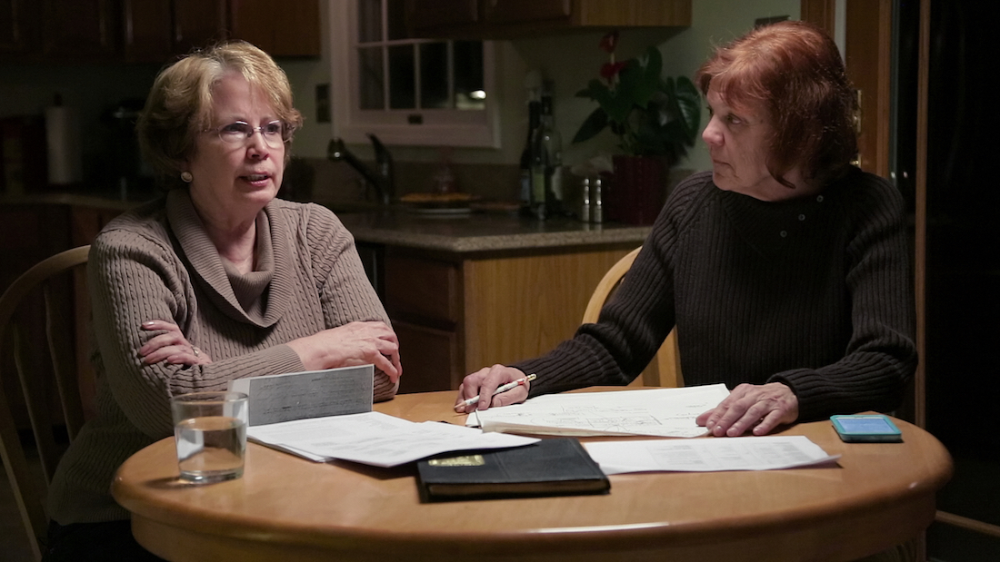
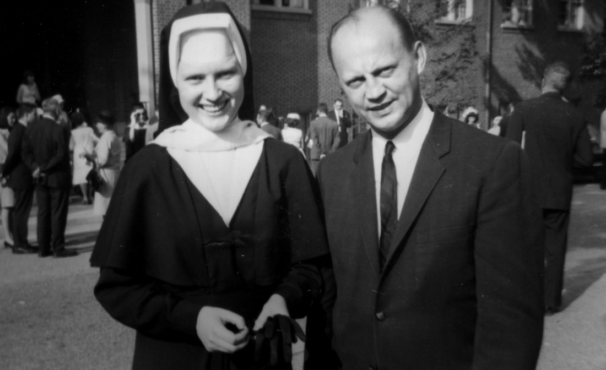

**Primer episodio**: 19 de mayo de 2017  
**Director**: Ryan White  
**Imdb** : [8.1](https://www.imdb.com/title/tt6792200/)

<figure class="kg-card kg-embed-card kg-card-hascaption">
    <iframe width="560" height="315" src="https://www.youtube.com/embed/Khr7dbuBjuE" frameborder="0" allow="accelerometer; autoplay; encrypted-media; gyroscope; picture-in-picture" allowfullscreen></iframe>
    <figcaption>The Keepers</figcaption>
</figure>

No se como se me paso esta serie, **The Keepers** es el claro ejemplo de que la realidad está al nivel e incluso más allá de una película, ya que el misterio entorno a la muerte de la hermana **Cathy Cesnik**, más aun, el responsable de su desaparición y muerte y la investigación en torno a esto es algo que trasciende a los años y se vuelve el centro de la vida de algunas personas, tal y como la serie muestra documentando la investigación del grupo de señoras que en su juventud asistieron al colegio Arzobispo Keough en Baltimore.

La historia se construye en base a la investigación de las señoras y a la información que reunió en base a entrevistas a personas que vivieron en esos años (60s y 70s), policías de la época, habitantes, quienes la encontraron, y por sobre todo el testimonio de **_Jane Doe_**, que se convierte en pieza crucial y en parte del macabro mensaje del documental.

### Corrupción y Encubrimiento

Al poco andar descubrirán que también fallecieron 2 miembros de la congregación, **Neil Magnus** y **Joseph Maskel**, y la joven **Joyce Malecki**. Los primeros vinculados a algunos casos de abusos sexuales con los pequeños del colegio, tema que agrega un nuevo ingrediente a la ya oscura historia en torno a la desaparición y muerte de la hermana Cathy y que complica más la ardua tarea de deslumbrar la verdad, sin olvidar que el paso de los años lo único que hace es eliminar pruebas y dejar que la verdad desaparezca con las personas.

Muy buena serie, **altamente recomendada** si te gusta la temática de investigación y casos policiacos, lo triste es que la verdad no es para nada esperanzadora.
