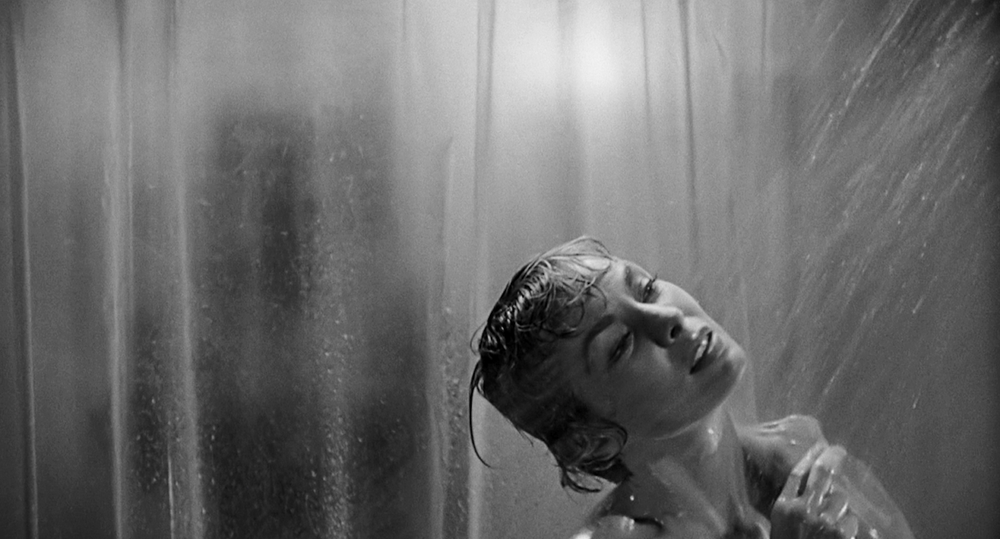
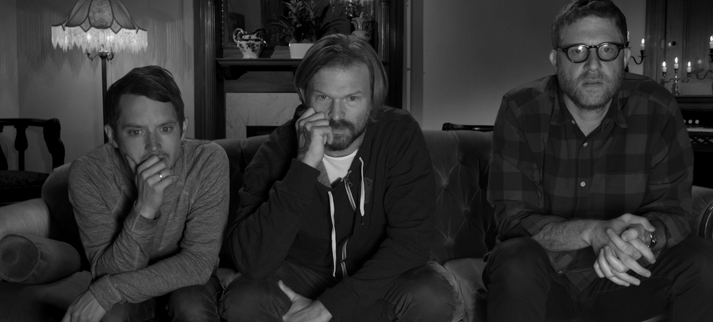
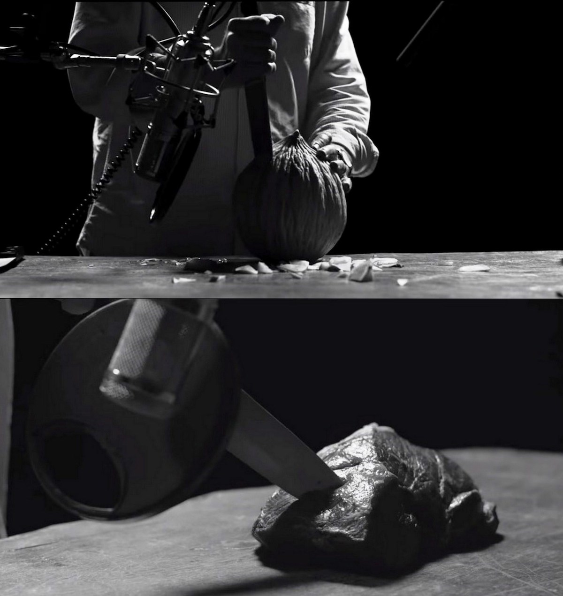
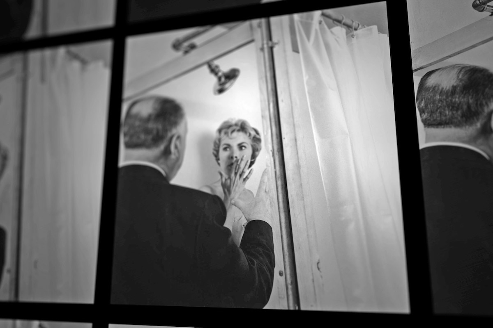

**Año**: 2017  
**Director**: Alexandre O. Philippe  
**Música compuesta por**: Jon Hegel  
**Guion**: Alexandre O. Philippe  
**Productores**: Robert Muratore, Kerry Deignan Roy  
**Imdb** : [7.3](https://www.imdb.com/title/tt4372240)

<figure class="kg-card kg-embed-card kg-card-hascaption">
    <iframe width="560" height="315" src="https://www.youtube.com/embed/rNHwKKdirxo" frameborder="0" allow="accelerometer; autoplay; encrypted-media; gyroscope; picture-in-picture" allowfullscreen></iframe>
    <figcaption>78 52</figcaption>
</figure>

### 78/52

Una de las escenas más homenajeadas del cine es el asesinato de la hermosa **Janet Leigh** en la ducha de la película **Psycho**, donde **Alfred Hitchcock** regala al mundo la semilla del slasher y un conjunto de sonidos que acompañarán a perpetuidad a cada meme y escena donde aparezca un asesinato. En **78/52**, el director suizo** Alexandre O. Philippe**, ahonda en la forma y fondo de dicha escena y en lo complejo y avanzado para su época que fue realizar esos 78 tiros de cámara y sus 52 cortes que dieron como producto un poco más de 45 segundos de metraje demostrando lo magistral, innovador e impactante de la mente de Hitchcock.

El documental a modo de homenaje está grabado en blanco y negro, tal como la película, y en él hablan un sin número de personas vinculadas al mundo del cine como editores, actores, directores, gente del mundo de los efectos especiales e incluso su propia protagonista. En él se analiza y comenta el proceso creativo y el resultado obtenido, como se hizo para realizar las tomas y lo complejo que era realizar dichos encuadres con cámaras que son enormes y se movían sobre un riel, cosas que hoy son muy simples como una toma frontal a una ducha en esa época era un montaje digno de un circo, así como esos planos superiores que se muestran en Psycho y la gran cantidad de detalles que plano a plano van a apareciendo y que son parte de un todo, ya que en el mundo de Hitchcock nada es al azar, y la mosca que vuela, el pájaro disecado y la dificultad de Norman Bates para decir 'baño' tienen un significado y dan solidez a un guión que envejece de manera impecable, y que dejando de lado apartados técnicos propios de la época, forman parte de una película completamente disfrutable en nuestros días.

Se muestra el proceso creativo y el storyboard que detalla las tomas, donde se inventa un nuevo lenguaje de planos extremos (que pasan a ser característicos de Hitchcock) y técnicas de grabación y sonido que posiciona al espectador en un contexto angustiante, haciéndolo parte de la escena compartiendo con él la agonía de la protagonista, que mostrando mucho sin mostrar nada transmite mediante una segunda lectura más emociones y sensaciones que las que están explícitas en pantalla... todo esto para terminar con una inquietante escena de un plano fijo de la pupila de Janet Leigh que se aleja de a poco, recorre el baño y sale del lugar.

### 1998

Se hace un leve mención a la película de Gus Van Sant, que replico plano a plano la película a color y que a pesar de contar con la bellísima y talentosa Anne Heche en el papel de Marion Crane, no logró ser efectiva en la escena de la ducha, mostró (mucho) más, pero no se acercó a lograr lo mismo que su predecesora y, honestamente, creo que es una película que nunca debieron hacer.

[Escena de la ducha de 1998 de Gus Van Sant](https://www.youtube.com/watch?v=XIy7K-8oEI4)

### En Conclusión

El documental es increíble e imperativo de ver por todo quien disfruta del cine, ya que a veces obviamos el trabajo detrás de una escena y pensamos que es llegar, grabar y editar, sin ver la gran cantidad de trabajo que hay detrás, que hacen que una secuencia sea más que solo eso y se convierta en un clásico digno de un análisis y estudio de más de hora y media, tal como la escena de la ducha, donde vemos a los rockstar (detrás) de la pantalla grande sonreír al ver magna creación.

[Escena de la ducha de la Psycho original](https://www.youtube.com/watch?v=8VP5jEAP3K4)

