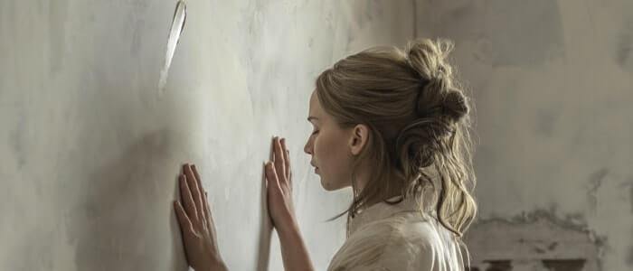
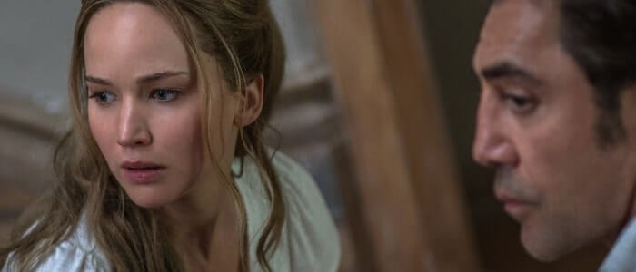
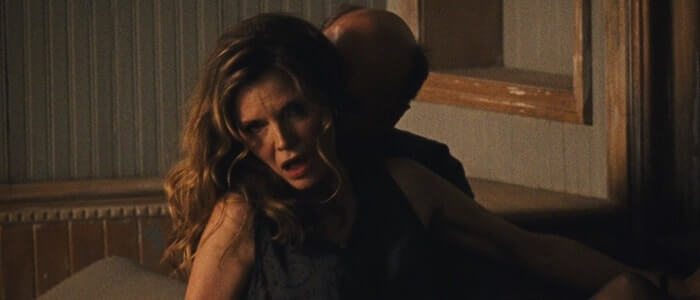
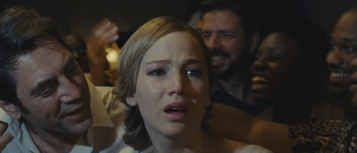
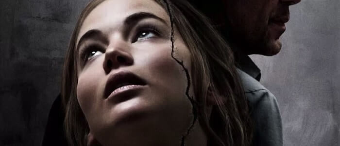

**Año**: 2017  
**Director**: Darren Aronofsky  
**Guion**: Darren Aronofsky  
**Recaudación**: 44,5 millones USD  
**Imdb** : [6.6](https://www.imdb.com/title/tt5109784)

<figure class="kg-card kg-embed-card kg-card-hascaption">
    <iframe width="560" height="315" src="https://www.youtube.com/embed/XpICoc65uh0" frameborder="0" allow="accelerometer; autoplay; encrypted-media; gyroscope; picture-in-picture" allowfullscreen></iframe>
    <figcaption>Mother</figcaption>
</figure>

### Mother!

Mother! es la septima pelicula de **Darren Aronofsky,** quien empezó siendo grande y trascendiendo a su época. En el 2000 dirigió Réquiem por un sueño y no paro nunca más, le siguieron La fuente de la vida (para mí demasiadas vueltas), El Luchador (Me gusto mucho), El Cisne Negro (Debería haber ganado el Oscar el 2011) y Noé (Cada vez que la veo me gusta más), siendo esta última una extraña mirada al mito del diluvio mezclando la visión de varias religiones en torno al exterminio por parte del creador hacia la humanidad, contrastando hechos como el Big Bang con la creación del mundo en 7 días y mostrando animales y criaturas ya extintas, así, como una visión diferente del planeta y su geografía en formación. En el caso de Mother! la alusión a la religiosidad está presente en su totalidad, vemos cómo se repasa la Biblia completamente, a continuación un análisis más paso a paso de las referencias que tiene el film.

### Madre es el hogar, la casa, donde la vida habita.

Madre! cuenta la historia de una pareja que se a alejado de todo y se va a vivir a una hermosa casa, en ella, Madre (**Jennifer Lawrence**), una joven arquitecta/remodeladora, y El Poeta o simplemente éL (**Javier Bardem**) buscarán tranquilidad e inspiración para crear y salir del lapsus de vacío creativo que lo atañe. Para algunas personas (creo que muy pocas) la historia se centrara en eso, en una pareja con muchos problemas donde despues de altos y bajos todo termina mal, en cambio si nos apegamos a los subtextos religiosos veremos como Aronofsky nos cuenta la biblia mediante metáforas. Claramente éL es Dios y el tiempo, un absoluto y eterno formador, el Dios creador que siente haber perdido su inspiración en algún momento y se está esforzando por encontrarla. Por otro lado, el personaje de Jennifer Lawrence es la Madre como concepto global, hace las veces de Madre Tierra, de la Virgen Madre, y por ende de inspiración para un artista, de musa que permite la creación y que tiene como objetivo convertir el lugar en algo mejor.

> Mother: I wanna make a Paradise.

### Genesis

La historia comienza con una mujer ardiendo (mujer que no volvemos a ver) y con un incendio del que solo queda un cristal, que entorno a él se crea la casa y luego Jennifer Lawrence, la que da el puntapié inicial de la pelicula cuando despierta (tal como lo hace Delores en la excelente serie Westworld), de hecho ambas secuencias están muy relacionadas. éL está muy ausente de la casa y Madre pasa la mayor parte del tiempo remodelando y convirtiendo el hogar en un paraíso (eh eh eh! El **Paraíso**), que a todo esto, es una casa con muchas habitaciones un poco atemporal y de distribución extraña, cuesta identificar rápidamente dónde está cada habitación dentro de la construcción. Ah! me faltaba decir que lo que vemos y sabemos es lo que el personaje de Jennifer Lawrence sabe y ve, la cámara la sigue y te permite empatizar con lo que siente y lo complicado que es para ella entender lo que ocurre a su alrededor.

### Adán, Eva, Caín y Abel

Todo comienza a alterarse cuando a la casa llega un hombre (**Ed Harris**), un médico (siente pasión por la vida) que admira a él y quiere conocerlo antes de morir (para pedir más vida). Es conocido simplemente como hombre y parece enfermo. Luego de una escena donde está vomitando y tiene una herida en un costado (Dios de una costilla de Adán hizo a Eva) llega a la casa Mujer (**Michelle Pfeiffer**), su esposa, quien tiene una actitud muy distinta a la del hombre y que parece hacer todo lo que quiera cuando quiera, es arrebatada y representa el apuro por vivir el hoy y el ahora. Si bien ambos se sienten atraídos a tocar el cristal de éL, hombre nunca lo hizo hasta que la mujer lo obligo, lo que terminó en que se rompiera el cristal y fueran expulsados de esa habitación por un furioso Poeta, lo que se sobre entiende como la expulsión de Adán y Eva del Edén cuando comieron de la fruta prohibida. Madre esperaba que dejaran la casa, pero no lo hicieron, solo se les prohibió el acceso a la oficina de éL. Luego llegan sus dos hijos (la envidia: **Brian y Domhnall Gleeson**) que discuten por el testamento de su padre (hombre), situación que termina cuando uno mata al otro (Caín y Abel). La sangre corre mediante el piso de la casa y crea un túnel a la oscuridad, un pasaje al infierno creado mediante un magno pecado como es quitar la vida. La mancha nunca se borrara de la casa y es lo que nos destina como humanidad a cosas tan atroces como la guerra, que deja estragos imborrables en la humanidad. Junto al túnel que se crea en la casa hay una especie de caldera, atención ahí.

El velorio realizado por la muerte del más joven de los hermanos trae mucha gente a la casa, conocidos del hombre y su esposa, ya que según la Biblia la humanidad parte de ellos y se expandio por el mundo (no solo tuvieron 2 hijos). Toda esta multitud hace uso de la casa como si fueran los dueños, frente a lo que Madre exige al poeta que los eche del lugar y este le contesta que no tienen donde ir, dejando claro que este es el único mundo que su creación tiene. El abuso y descontrol de la multitud aumenta y todo comienza a salirse de control.

### Diluvio Universal

Madre trata de controlar a las personas, de evitar que rompan la casa, pero estas no lo quieren hacer, la humanidad que tanto venera a Dios no se preocupa del lugar donde están, hacen uso y abuso del paraíso creado por Madre hasta que rompen un lavamanos y la casa comienza a inundarse (Diluvio). Madre les grita que se vayan de ahí y poco a poco la multitud se comienza a ir de la casa. 
Después de esto la casa queda en calma y Madre le dice al Poeta que ella no ha tenido hijos porque éL no la toca, situación que desencadena el embarazo de Madre. Aquí el concepto de Madre Tierra cambia a Madre creadora y dadora de vida humana, a la Madre de Cristo, María. Junto con lo cual el Poeta recupera nuevamente su inspiración y escribe un nuevo libro (Referencia clara al Nuevo Testamento y/o Cristianismo), que resulta ser un éxito inmediato y hace famoso al Poeta en todo el mundo (mundo que fue poblado por la gente expulsada de la casa y que ha aumentado en cantidad. El éxito generado atrae nuevamente a la humanidad hacia la casa, humanidad que busca idolatrar al poeta por la masificación de su obra (cosa que le gusta al Poeta).

> Mother: What do they want?
> HIM: They&#39;re waiting.
> Mother: Waiting for what?

### Jesús

La llegada de la gente es porque saben que algo viene, ese algo es el hijo de Madre y éL, en otras palabras Jesús o La Religión que congrega a la gente entorno a ella. Aquí viene una escena bastante extraña y fuerte dentro del film, por lo gráfico de los hechos y lo explícito de los sonidos. El poeta presenta a la humanidad a su hijo, multitud que toma al bebé y lo van pasando de mano en mano causándole la muerte de una forma brusca, terminando por devorara al pequeño. Aquí entiendo 2 cosas, la primera que es una alusión a la última cena, donde comen y beben el cuerpo de cristo, y a la muerte de Cristo en manos de su propio pueblo y la segunda es algo más contemporánea, y apunta al proceso de "la paz" y la "comunión" que ocurren en misa, pasan a Jesús por todos y luego lo devoran comiendo su cuerpo y bebiendo su sangre. En el grupo de "gente" se logra vislumbrar que no son todos iguales, que algunos pasan el mensaje y hacen las veces de líderes, pueden ser los discípulos o las cabezas religiosas como el Papa, o simplemente sacerdotes.

> La humanidad sólo será salvada por medio de Jesús.

Luego viene el capítulo final de la película, donde vemos que todo lo bueno que Madre construyó se esta dañando y no es cuidado por las personas, el mensaje es claro, la crítica a la sociedad actual que devora todos los recursos naturales y abusa sin control de lo que "el mundo" nos entrega queda explícitamente señalado, somos una sociedad que devora y manipula lo que Dios y/o La Madre Naturaleza nos han entregado para nuestro bienestar... como siempre, no valoramos nada hasta que lo rompemos.

### Apocalipsis

Madre pierde el control, pero la multitud es muy grande y le causan más daño a ella. Ya no es capaz de defenderse, cuando cae hace temblar la casa, recordemos que están unidas. Le pide al Poeta que saque a la gente, que no son personas buenas, pero el se niega, le dice que no quiere que se alejen (todos sabemos que Dios nos quiere sin importar lo que hagamos), situación que madre no aguanta, baja y provoca un incendio con la caldera junto al "infierno" quemando a todos, situación que deja la casa en ruinas, estando intacto el Poeta. Aquí Madre le pregunta que es él y el poeta contesta "Yo soy Yo", es el Todo, el que ha estado siempre y siempre estará, el tiempo, el eterno creador que si algo falla debe volver al comienzo e intentarlo nuevamente.

### Desenlace

El Poeta, luego de la pregunta de Madre, le dice necesita algo de ella, su amor, simbolizado en su corazón (que es un cristal), al tenerlo es como un reset la casa se reconstruye y todo esta como en un comienzo. Hay una mujer en la cama, pero no es Jennifer Lawrence, es otra mujer, otro avatar de la Madre Tierra, una nueva oportunidad para intentar todo de nuevo, el artista perdió su inspiración nuevamente y espera volver a encontrarla otra vez en este nuevo ciclo.

Dios estará ahí para siempre y desde siempre, es viejo, ególatra y vivirá el ciclo las veces que sea necesario porque necesita de la idolatría de las personas sin importar si con eso daña al planeta, porque puede reconstruirlo, y volverá a empezar las veces que quiera.

### Recomendada?

Altamente recomendada si te gustan los mensajes entrelineas y disfrutas del cine de Aronofski, personalmente hace poco La Fuente y no me gusto mucho, encontré que daba demasiadas vueltas innecesarias, pero sus demás films me agradan mucho así que me volqué a ver Madre! y no me arrepiento. Es lejos de lo que más me ha gustado este año. Ignore las criticas negativas y forme su propia opinión.

Algo que no se me ocurre que és y que busque, pero no encontré, es que es liquido amarillo/dorado que toma Madre... por un momento pensé que era "el fuego" o que era el "oro", por su implicancia en el poder y el valor de las cosas en el mundo.
