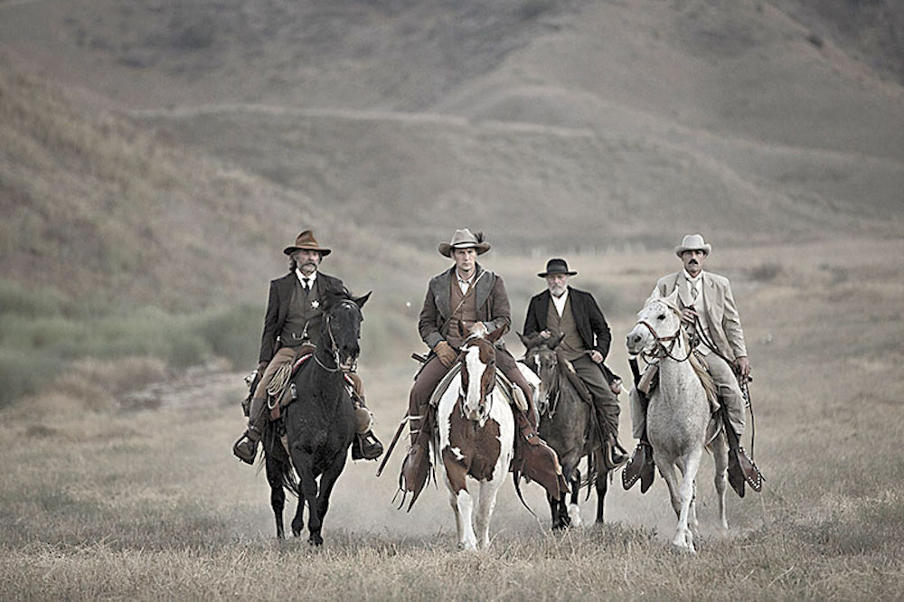
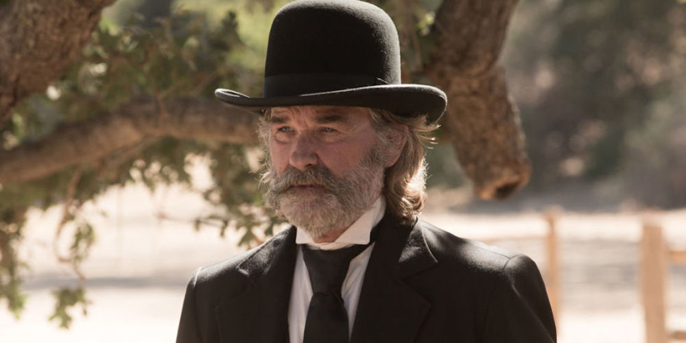
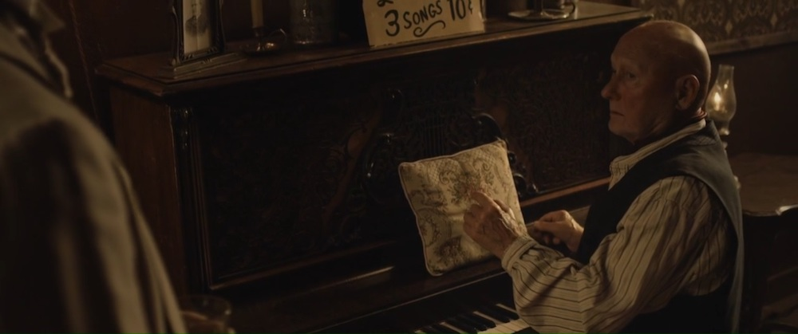

**Año**: 2015  
**Director**: S. Craig Zahler  
**Recaudación**: 481.525 USD  
**Presupuesto**: 1,8 millones USD  
**Imdb** : [7.1](https://www.imdb.com/title/tt2494362)

<figure class="kg-card kg-embed-card kg-card-hascaption">
    <iframe width="560" height="315" src="https://www.youtube.com/embed/0ZbwtHi-KSE" frameborder="0" allow="accelerometer; autoplay; encrypted-media; gyroscope; picture-in-picture" allowfullscreen></iframe>
    <figcaption>Bone Tomahawk</figcaption>
</figure>

**Tomahawk** es el nombre que reciben las hachas cortas o de mano usadas por las tribus nativas de América, que en un comienzo eran de hueso y luego con la llegada de los Europeos se fabricaron en metal y su diseño varió un poco asemejandose a las usadas por los vikingos, por lo tanto la traducción textual del nombre de esta película seria algo así como **_Hacha de Hueso_** lo que si se mezcla con el nombre que se le dio en Latinoamérica, **_Frontera Canibal_**, nos da un claro escenario de lo vamos a ver.

### El Salvaje Oeste

Una tribu prehistórica sigue a un hombre hasta un pueblo del lejano oeste, donde raptan a una mujer y a un oficial, frente a lo cual el Sheriff Hunt (**Kurt Russell**), el esposo de la mujer raptada, Arthur O'Dwyer (**Patrick Wilson**), el asistente Chicory (**Richard Jenkins**) y el ex-soldado Brooder (**Matthew Fox**) se embarcan en una misión de rescate en medio de un territorio indómito dominado por salvajes que parecen remanentes del pasado.

Al igual que en los clásicos western, los personajes son iconicos y representantes de un estereotipo de la época, tenemos al "comisario héroe", a su fiel y siempre correcto asistente, al vaquero que hará de todo por su esposa y al eficiente guerrero que conoce de técnicas militares y no piensa 2 veces a la hora de disparar. Mediante diálogos inteligentes y practicas secuencias, el director **S. Craig Zahler**, crea un nuevo western crudo y sin censura que recuerda a los clásicos, pero que nos golpea con una dosis de gore recalcando lo &quot;salvaje&quot;&nbsp;de la época en que transcurre la historia.

**Kurt Russell** nació para personajes como este, su look es muy parecido al de **The Hateful Eight** y hace un papel impecable, al igual que todo el elenco que esta lleno de estrellas (hasta sale el director del colegio de Marty McFly).

**Recomendable**, pero no apta para todos los estómagos, tiene una que otra escena demasiado fuerte.
