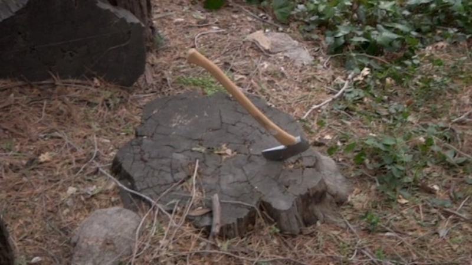
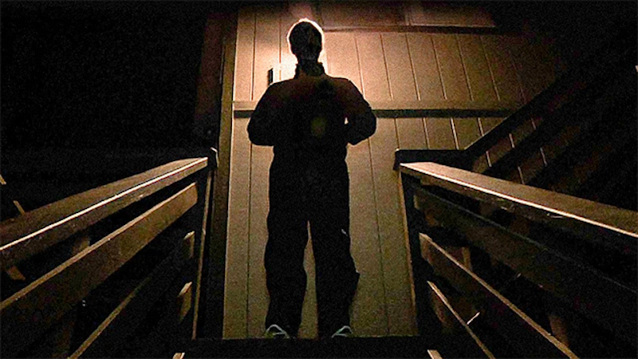
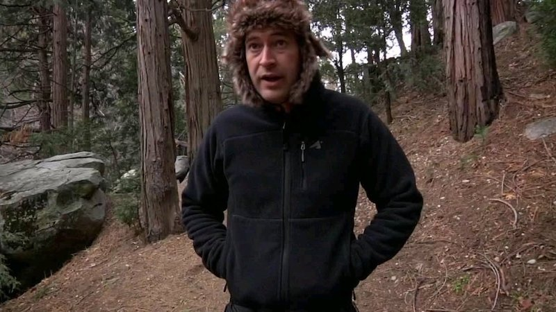
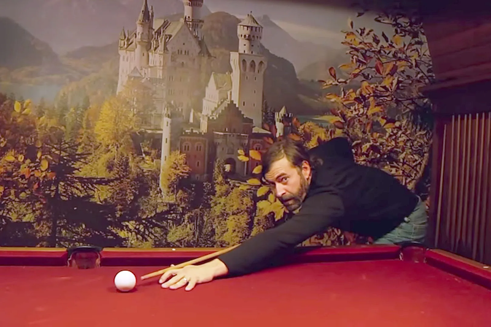

**Año** : 2014  
**Director** : Patrick Brice  
**Plataforma** : Netflix  
**Imdb** : [6.3](https://www.imdb.com/title/tt2428170/)

<figure class="kg-card kg-embed-card kg-card-hascaption">
    <iframe width="560" height="315" src="https://www.youtube.com/embed/FBR8VcdpE4Y" frameborder="0" allow="accelerometer; autoplay; encrypted-media; gyroscope; picture-in-picture" allowfullscreen></iframe>
    <figcaption>Creep</figcaption>
</figure>

### Dinero fácil

Corroborar la foto del chofer de Uber o reunirse con alguien a ciegas en lugares públicos son siempre medidas de seguridad que debemos tener sí o sí, pero ¿qué pasa cuando hay una publicación en una web que ofrece un muy buen dinero (1000 usd) por grabar un día de una persona? nadie investiga, el dinero fácil sega y hace a un lado la seguridad y la precaución, convirtiendo un negocio demasiado bueno para ser verdad en una oportunidad imperdible de obtenerlo… eso le ocurre a nuestro protagonista Aaron, interpretado por **Patrick Brice** (quien además dirige y firma el guión de la película), quien al ver la oferta de trabajo decide tomarla sin investigar nada.

Al llegar al lugar indicado en la publicacion conoce a Josef (Mark Duplass), quien se muestra como un tipo de muchos recursos que necesita la ayuda de Aaron para registrar un dia de su vida, ya que está por morir y quiere dejar un recuerdo a su familia. a Aaron le parece un buen motivo y sigue al estrafalario Josef en sus actividades diarias, ayudándolo a decidir por buenas tomas, puestas de sol e iluminación, jornada que termina con ambos volviendo a la casa de Josef al final del día, momento en que Aaron nota que no están sus llaves por ningún lado. Aquí comienza todo.

### Mienten... todos mienten

Creep es un film simple, un elenco de solo 2 personas que te engancha por el buen uso de su "cámara en mano" y los diálogos son muy divertidos, somos testigos explícitos de cosas que hacen y piensan lo que nos lleva a titubear entre cual es el cazador y la presa y que nos llenará el visionado de risas nerviosas porque es difícil ver cuando algo es gracioso o irónico u oscuro o todos lo anterior.

### Locura predecible y muy divertida

Una película divertida donde nos demoramos en conocer (de verdad) a los personajes y saber sus reales intenciones, está llena de humor y cosas que te hacen reir por patéticas o inesperadas y que demuestra, estando muy lejos de ser una obra maestra, que con muy poco dinero y con un elenco ínfimo se puede hacer algo fresco que engancha y perturba a la vez.

Un final predecible y un giro que se ve venir, pero del que no tienes seguridad hasta que pasa. A pesar de lo estereotipado y extraño-gracioso de los personajes es muy probable que el mundo este lleno de Josef y Aaron :S

**Moraleja**: no te juntes con extraños en una cabaña alejada del mundo donde te ofrecen 1000 usd por grabar un dia de su vida

Disponible en <a href="https://www.netflix.com/title/70306646" target="_blank">Netflix</a>

