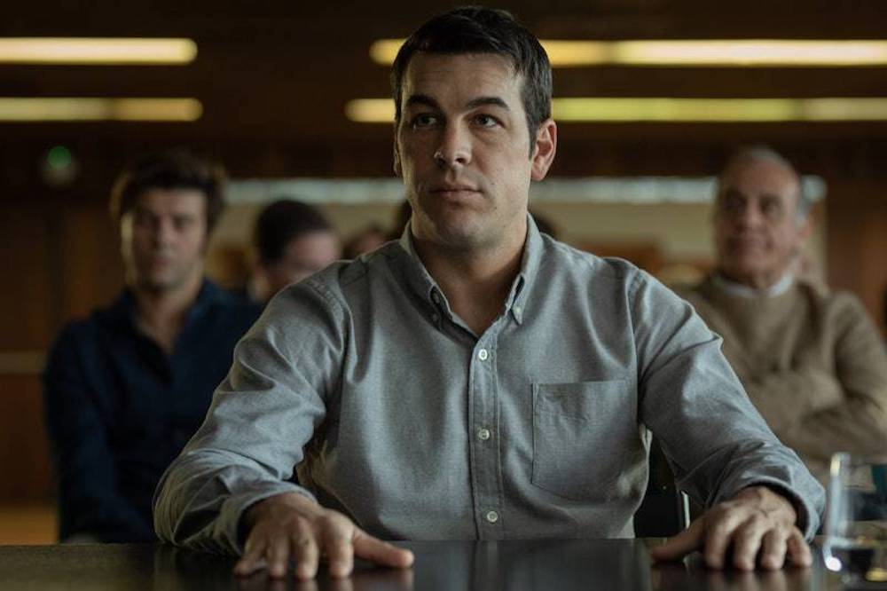
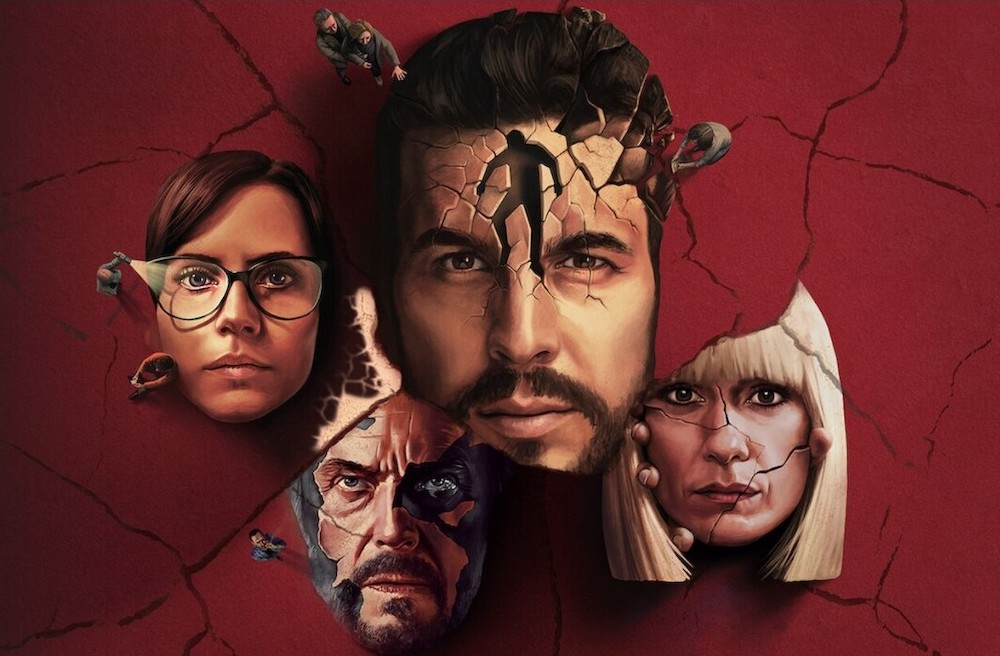
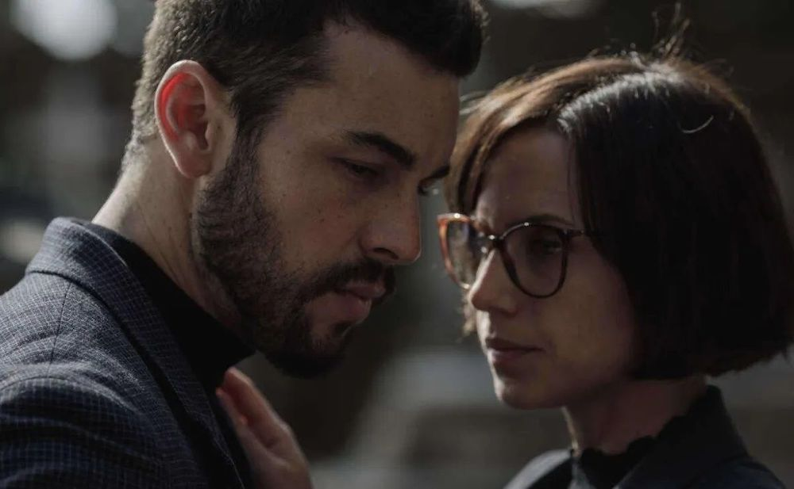

**Año** : 2021  
**Plataforma** : Netflix  
**Imdb** : [7.9](https://www.imdb.com/title/tt10147644/)

<figure class="kg-card kg-embed-card kg-card-hascaption">
    <iframe width="560" height="315" src="https://www.youtube.com/embed/FoYWQ3hC5jo" frameborder="0" allow="accelerometer; autoplay; encrypted-media; gyroscope; picture-in-picture" allowfullscreen></iframe>
    <figcaption>El Inocente</figcaption>
</figure>

### El Inocente

El Inocente nos presenta a **Mateo Vidal** (Mario Casas), quien tras una mala decisión se ve atrapado en una pelea a las afueras de una fiesta, donde por accidente causa la muerte de otro joven. Su vida se rompe y debe ir a prisión por varios años. Luego de cumplir su condena reinicia su vida, vuelve a encaminar sus estudios y se vuelve socio de la empresa de la firma de abogados de su hermano. Ahí se encuentra nuevamente con la mujer de su vida, Olivia, y la vida le parece dar una nueva oportunidad para sonreír.

Un día Olivia recibe una llamada y debe hacer un viaje. Durante este viaje Mateo recibe unos extraños mensajes desde el móvil de Olivia y todo comienza a volverse extraño, una vez más la vida de Mateo se rompe y una vez más él parece ser inocente… asesinatos, mentiras y el oscuro pasado de cada uno de los personajes va aflorando episodio tras episodio mediante una breve y dinámica presentación.

### No podemos huir de nuestro pasado

La miniserie cuenta con un grupo de personajes que se entrecruzan una y otra vez a lo largo de la historia, de cierta forma es como ver un episodio de Los Simpsons, donde los personajes si o si se relacionan entre ellos y los lugares comunes son nexos de reuniones, nacimientos, muertes y encuentros de todo tipo entre los personajes. Este punto quizás agota, ya que las coincidencias son demasiadas, pero se lo perdonamos ya que el ritmo es muy bueno y dejamos pasar las coincidencias forzadas a cambio de una nueva narración.

Con cada episodio sabemos más de los personajes y comenzamos a comprender cómo calzan las diversas historias, a momentos teorizamos, pero luego nuestra teoría se cae y vamos por otra. La motivación de cada personaje y la consecuencia de sus actos son como una pieza más de dominó que cae y que, de cierta forma, provoca una avalancha de eventos que condicionan e impactan a todos, un asesinato, una venganza, un nacimiento… todo, absolutamente TODO tiene concecuencias.

Uno de los puntos más fuertes es el elenco, a todos los personajes les creí todo. Mario Casas está muy bien en el protagónico y el trío de mujeres fuertes: Olivia (Aura Garrido), la comisario Ortiz (Alexandra Jiménez) y Zoe (Anna Alarcón) la amiga de Mateo son geniales (al igual que todo el elenco). La forma en cuentan el pasado de cada personaje es muy entretenida, creo que una de las mejores cosas de la serie (además de las actuaciones) es el ritmo, ayuda mucho la seriedad con que se toma a sí misma.

Lo único que a momentos agota son las excesivas coincidencias, pero como comente mas arriba, se lo perdonamos dadas la gran cantidad de cosas buenas (actuaciones y ritmo). Mi mayor problema (no creo que sea un spoiler) es que el final se extiende, podría haber terminado antes y creo que, si bien ese "alargue" es para aclarar algunas cosas, me pareció innecesario y arrítmico. La secuencia final, esta muy bien y nos hace sonreír de manera nerviosa e incorrecta.

### Recomendada?

Muy recomendada, es una miniserie autocontenida con buenas actuación y muy buen ritmo, el que tenga problemas con el "español de España" la puede ver con subtítulos. Por momentos me recordó a Hogar, pero tiene su propia identidad. Ideal para maratón de fds.

Disponible en <a href="https://www.netflix.com/title/81036936" target="_blank">Netflix</a>

