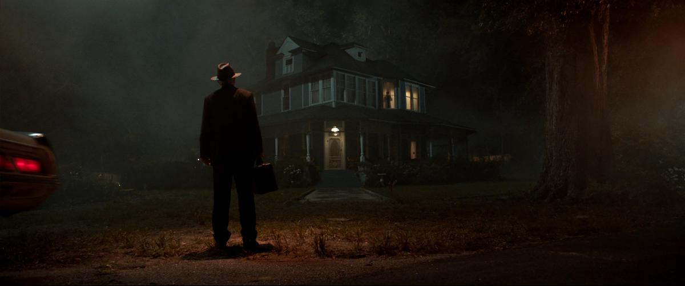
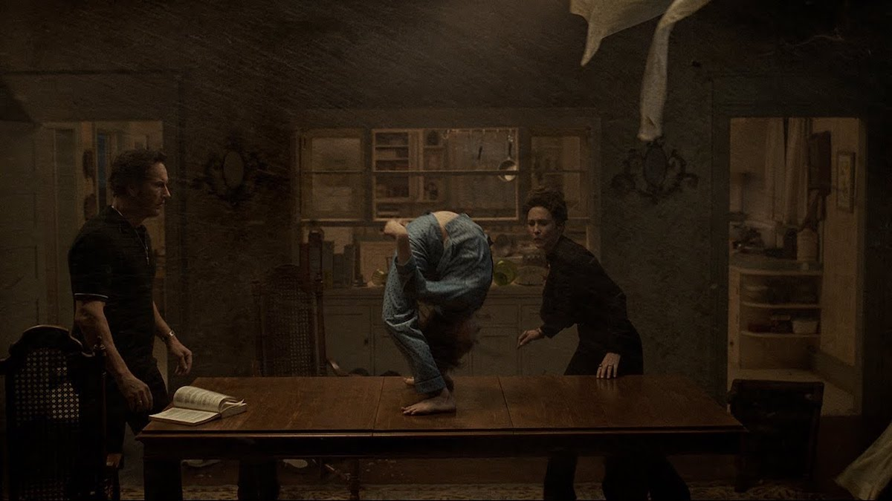
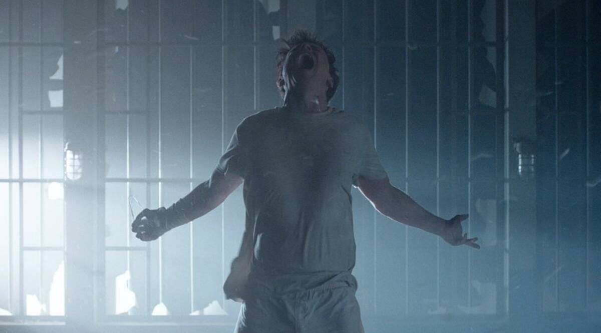
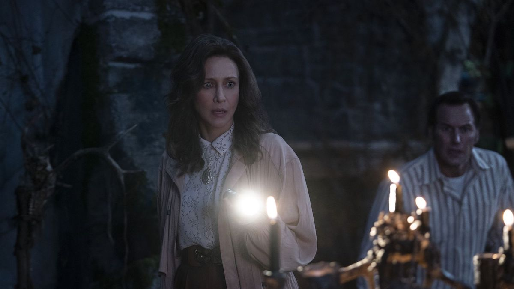
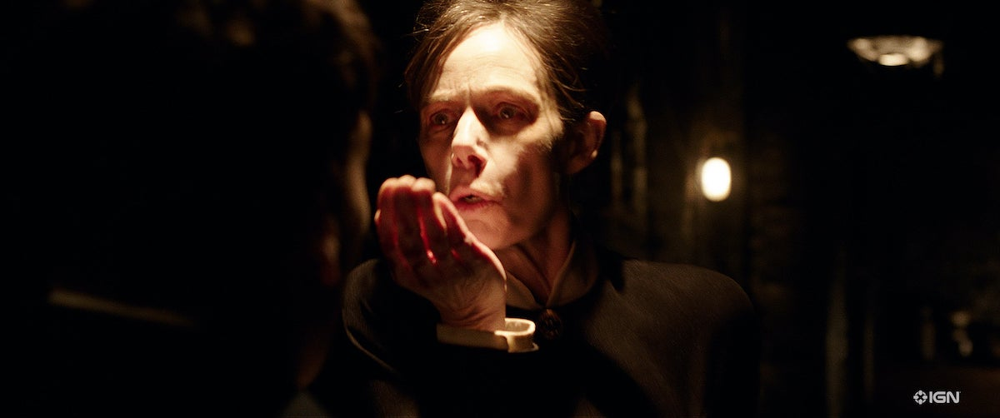

**Año** : 2021  
**Director** : Michael Chaves  
**Imdb** : [6.5](https://www.imdb.com/title/tt7069210/)

<figure class="kg-card kg-embed-card kg-card-hascaption">
    <iframe width="560" height="315" src="https://www.youtube.com/embed/h9Q4zZS2v1k" frameborder="0" allow="accelerometer; autoplay; encrypted-media; gyroscope; picture-in-picture" allowfullscreen></iframe>
    <figcaption>The Conjuring 3</figcaption>
</figure>

### The Conjuring: The Devil Made Me Do It

Michael Chaves dirige la tercera (y probable cierre) de la saga The Conjuring, la cual se enfocará una vez más en un “caso real”, en esta ocasión un asesinato donde el culpable señala que estaba poseído a la hora cometer el asesinato. La historia real está decorada por varios elementos interesantes y personajes nuevos que enriquecen la narración y hacen más disfrutable la cinta de terror que sirve de epílogo para la exitosa saga creada por James Wan.

Ed (Patrick Wilson) y Lorraine Warren (Vera Farmiga) son lejos lo mejor de la película, lo que no significa que el resto sea algo malo, sino que sobre destaca la calidad actoral y lo interconectados que están ambos, logrando traspasar lo fuerte de su relación y lo importante y vital de su amor, pieza clave de este film.

La historia, como buena cinta de terror sobrenatural, comienza con un Exorsimo que sale mal y que pasa una entidad demoniaca de un niño a su hermano mayor, quien en los primeros minutos del film asesina a otra persona y afirma haber estado poseído cuando cometió el delito. Además de este personaje, The Conjuring, incorpora un nuevo “villano”, diferente a los típicos seres sobrenaturales de entregas anteriores como Valak o CrackerMan, su origen y poderes se abordan de una mejor manera y se le da un trasfondo más completo (no complejo, solo completo) que enriquece al personaje y le da más herramientas narrativas que construyen un mejor relato entorno a él.

Visualmente está muy bien, excelentes sets, locaciones abiertas muy iluminadas, recursos de recuerdos paralelos, ambientaciones oníricas que chocan con la realidad y un sinnúmero de recursos que crean un ambiente perfecto para cada escena. Agradesco de sobremanera la reducción de jumpscare y la incorporación de una trama centrada en una investigación más detectivesca / sobrenatural que a momentos nos trae a la mente algún episodio de X-Files o Twin Peaks y que permite evidenciar de forma mas explicita las habilidades de Lorrain... y, desafortunadamente, los problemas de salud de Ed.

Los fantasmas/espíritus/otros están muy bien logrados, tal como pasa con el antagonista de la historia, son mucho más aterrizados en diseños y “poderes”, se ven muy aterradores, pero no por decoraciones fantásticas, sino por lo reales y cercanos que se sienten. Hay una escena en un morgue que es muy buena, a pesar de no contar con grandes efectos especiales, más bien una buena iluminación, decorado y muy buenos efectos prácticos logrando un resultado de alta calidad.

El cierre, tanto del caso como de la película, son muy satisfactorios y nos dejan con una sonrisa (por Ed y Lorrain) ya que de cierta manera se recobró el camino iniciado por El Conjuro 1 que había sido tantas veces desviado por películas como Annabelle o La Monja.

### Recomendada?

Sí, me gusto bastante, la historia me entretuvo y la dupla de Patrick Wilson y Vera Farmiga funciona tan bien en pantalla que es un agrado verlos. Visualmente increíble y con varios homenajes a clásicos del terror, sobre todo cuando un sacerdote llega a hacer un exorcismo, una escena que claramente hace alusión a la llegada del Padre Merrin en El Exorcista. El subtítulo de la cinta, “The Devil Made Me Do It” se justifica de una forma excelente y se siente muy apropiado. En mi opinión, mejor que El Conjuro 2 y muy a la altura de El Conjuro 1... hasta pronto The Conjuring
