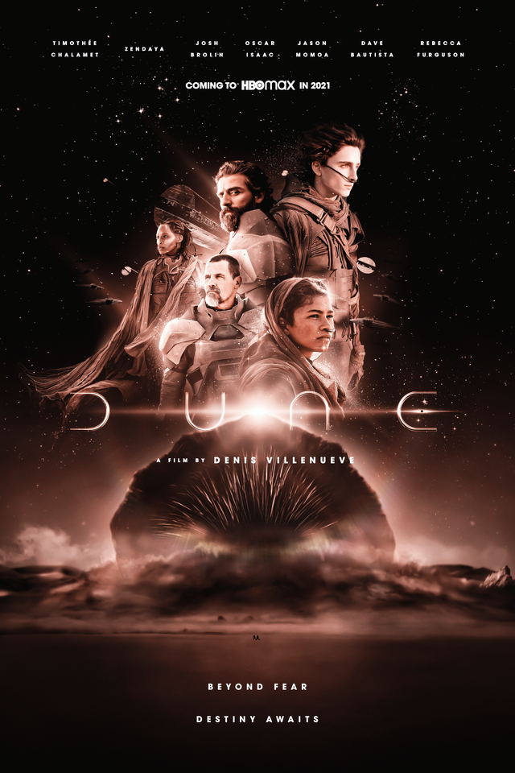
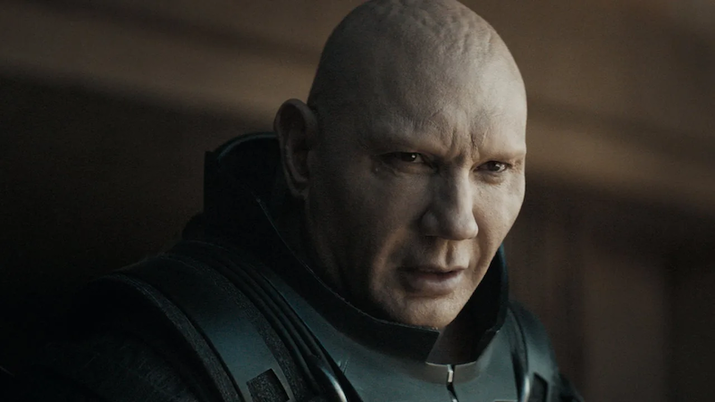
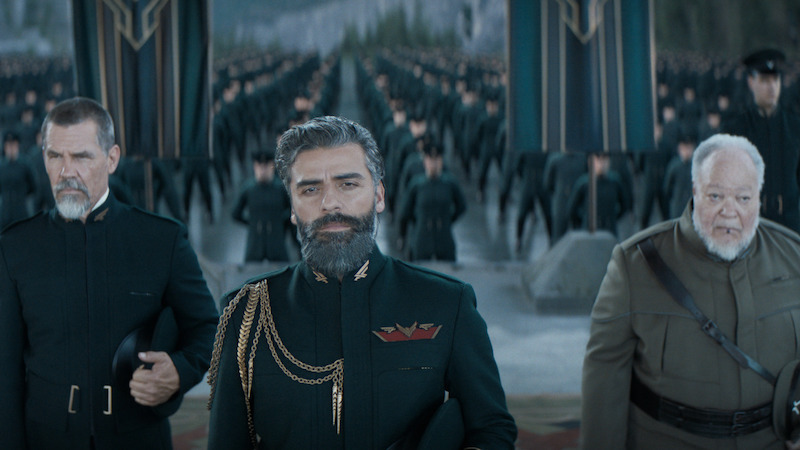
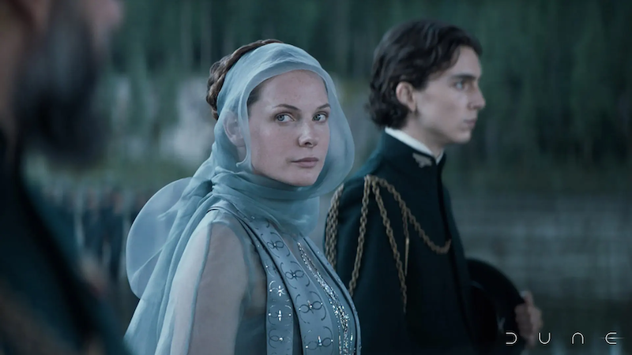
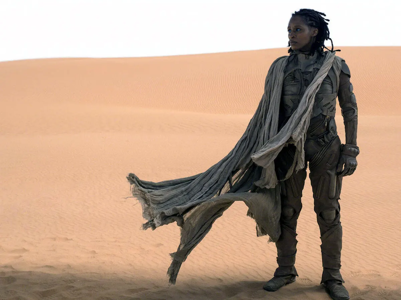
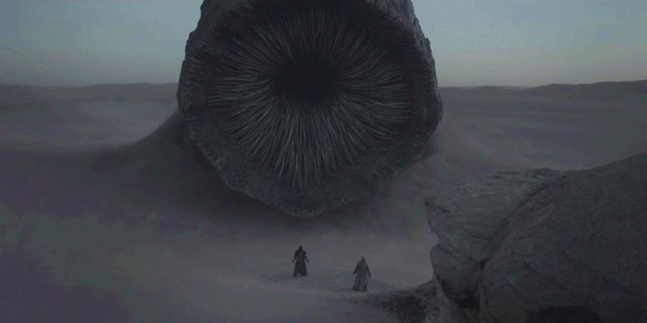

**Año** : 2021  
**Director** : Denis Villeneuve  
**Imdb** : [8.3](https://www.imdb.com/title/tt1160419/)

<figure class="kg-card kg-embed-card kg-card-hascaption">
    <iframe width="560" height="315" src="https://www.youtube.com/embed/8g18jFHCLXk" frameborder="0" allow="accelerometer; autoplay; encrypted-media; gyroscope; picture-in-picture" allowfullscreen></iframe>
    <figcaption>Dune</figcaption>
</figure>

Hace un par de meses vi **Dune** de **David Lynch (1984)** y, como suelo hacer con películas que ya tienen sus años, dejé de lado la calidad de los efectos y me centro en la historia, como se cuenta y el "cariño" que le ponen a cada cosa, desde el director y su equipo hasta los actores. Con esta idea y un par de cafés me llevé una grata sorpresa. A pesar de la extraña edición y lo extensa que se siente, termine con una sonrisa y con muchas cosas para conversar... Hace unas semanas vi Dune, esta vez la de Denis Villeneuve, igual termina con una sonrisa, pero por motivos muy muy diferentes.

### Villeneuve / Zimmer

**Denis Villeneuve** siempre hace películas magnas, enormes, detallistas y con gran enfoque en lo visual. Es cosa de volver a sus últimos films como Blade Runner 2045 (2017) y Arrival (2016), ambas geniales y perfectas a nivel visual. En Dune esto se megapotencia gracias a **Hans Zimmer**, quien puede convertir un simple desayuno en una escena épica por el OST. Villeneuve a momentos me recuerda a lo que hizo Ridley Scott en Prometheus, llevando al límite la elegancia y los detalles de cada escena. Tenemos secuencias que en la versión del 84 son triviales y simplistas y que ahora son magnas, siniestras y perfectas, como la secuencia donde marcan a los soldados del emperador y cada una de las tomas aéreas con pequeñas naves desplazandose por el infinito espacio. Cada presentación, de un lugar o personaje, cada sueño revelador de Paul y cada entrada en escena de algún elemento es una experiencia inolvidable.

### Dune

La película es larga. Son **2 horas y 35 minutos**, donde poco a poco nos cuentan la épica historia de **Paul Atreides** (Timothée Chalamet), descendiente de la casa Atreides. Quien, junto a su padre, comandará la misión de recuperar el planeta Arrakis para el Imperio. Arrakis es deseado por todas las casas (si, hay casas. Algo así como en Juego de Tronos) por producir la **Especia**, una sustancia que permite viajes por el espacio y da habilidades a quienes la consumen. La Especia fue explotada por la casa Harkonnen por más de 80 años y actualmente es habitado sólo por unos gusanos enormes, que hacen las veces de guardian natural de la **Especia**, y por un particular pueblo que ven en Paul a un supuesto elegido, un messiah salvador, señalado por una profecía para liberarlos y hacer de Arrakis un pueblo libre.

El espacio, las naves, los planetas y todo entorno a ellos es genial, se siente de otro mundo y se ven muy reales. No hay naves llenas de luces, sino opacas... al igual que el film, ya que alrededor del primer tercio del film parece una película de terror, luego se ilumina un poco, pero siempre mantiene ese tono oscuro que mezcla creencias y habilidades más allá de las típicas películas de ciencia ficción.

### Los Harkonnen, antes y ahora

De la película del 84 recuerdo muy bien a los villanos de la historia, el gordo volador y sus sobrinos. Acá lo exagerado de esos personajes se convierte en terror. Stellan Skarsgard interpreta a un **Vladimir Harkonnen** terrorífico, crudo y, sobre todo, oscuro y el primero al mando del ejército Harkonnen ahora es interpretado por un casi albino Dave Bautista, un excelente ejemplo de la mano armada de su familia y un líder que se ve, sobretodo fuerte y un gran guerrero.
Donde esta Sting?

### Sin spoilers, pero...

Hay muchas diferencias entre la versión de Lynch y la de Villeneuve, extrañé algunos personajes, pero agradecí de sobremanera muchas otras cosas que no había entendido o que quizás no asocie a momentos épicos. Esta vez Villeneuve y Zimmer dan el contexto y epicidad perfecta a cada escena que lo requiera. Los sueños premonitorios, la entrada de los personajes y las revelaciones se marcan mucho más y se agradece el tiempo que se toman para ir construyendo y avanzando.

### ¿Lo mejor?

- El apartado visual es increíble, tanto en decorados como en vestimenta. Un deleite a los sentidos.
- La escena donde marcan a los Sardaukar es increíble...

### ¿Lo peor?

- Creo que no es para todos, no por algo presuntuoso como que la historia es compleja y bla bla, sino simplemente porque es muy extensa y no termina, me explico, termina una parte de la historia, pero claramente no es el cierre de Dune.
- Falta explicitar varias cosas, creo que netamente para no ser categorizados como película para mayores de 18 años, omitieron muertes y controlaron las secuencias de acción (con un exceso de luces producto de los golpes contra lo escudos corporales) para que no abundara la sangre.

### Gran película

Dune es una película carísima, no solo en dinero (165 millones), sino también en tiempo... lo que golpeará fuerte en el lanzamiento de su secuela, que probablemente llegue por allá por el 2023. Ojalá el tiempo no dañe el buen sabor de boca que deja la película actualmente y se mantenga fresca para cuando llegue la segunda parte. Muy recomendada :)

#### Extra

En cuanto vi la versión del 84, sabiendo que saldría una nueva adaptación, me quedó en mente la duda de cómo harían las armaduras y la voz. En el caso de las armaduras, tengo sensaciones encontradas, me gusta como se ven en los personajes, pero cuando pelean son demasiadas luces y se vuelve un poco confuso, se le quita la fuerza y la intensidad a los golpes. **La voz**, bueno... ahora está increíble, gracias Villeneuve por ese "gran" cambio :)
