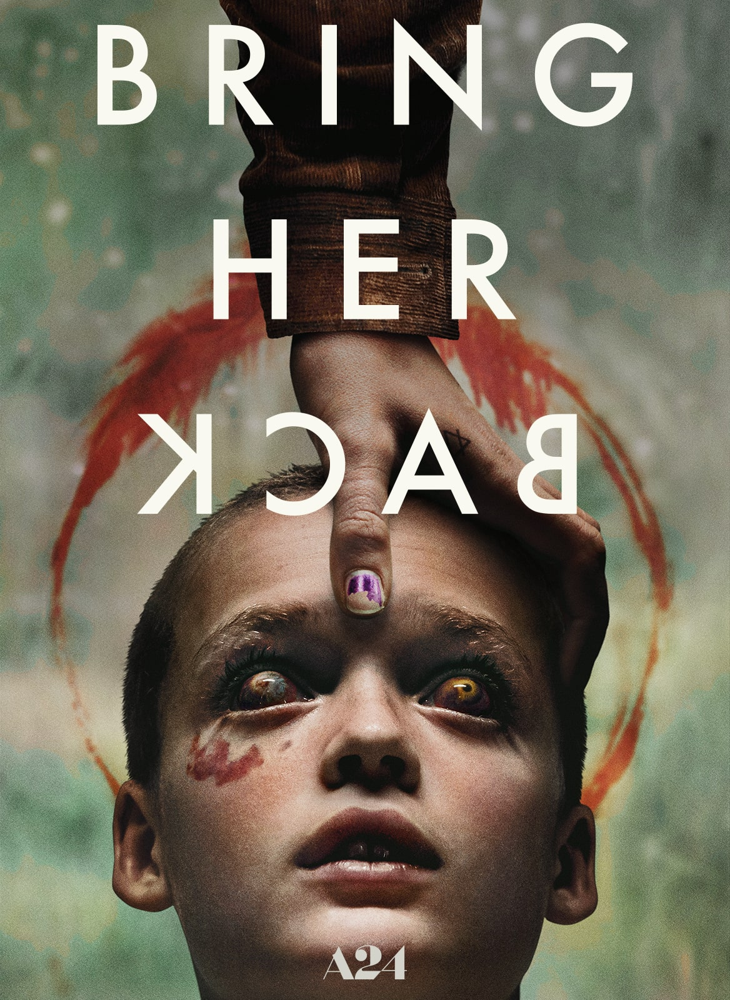
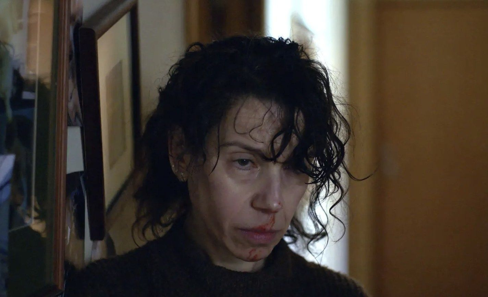
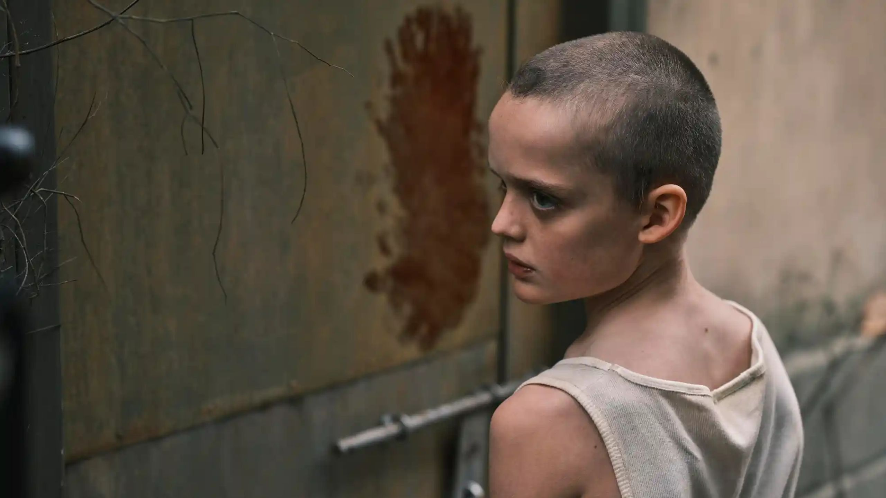

**Año** : 2025  
**Director** : Danny & Michael Philippou  
**Guionistas** : Danny Philippou, Bill Hinzman  
**Productora** : A24  
**Imdb** : [Ficha](https://www.imdb.com/title/tt32246771/)

<figure class="kg-card kg-embed-card kg-card-hascaption">
  <iframe width="560" height="315" src="https://www.youtube.com/embed/kBskrYZfhw8" frameborder="0" allow="accelerometer; autoplay; encrypted-media; gyroscope; picture-in-picture" allowfullscreen></iframe>
  <figcaption>Bring Her Back</figcaption>
</figure>

### Horror íntimo que aprieta el pecho

La nueva de los hermanos Philippou (los de *Talk to Me*, una de mis favoritas de ese año) no busca el susto fácil. Arranca como un drama sombrío marcado por el duelo y termina mostrando una casa que late con una liturgia enferma. Dos hermanastros caen al cuidado de una madre adoptiva que, desde el inicio, intuimos que no es lo que aparenta. Lo mejor es que la película entiende que el terror funciona de verdad cuando duele, y aquí duele. El diseño sonoro raspa, el montaje nunca subraya de más y la atmósfera ritual se pega a la piel.

### Actuaciones y tono

El corazón de todo es **Sally Hawkins**, que sostiene la película con una mezcla rara entre ternura rota y amenaza constante. A su lado, **Billy Barratt** y **Sora Wong** funcionan bien como dupla en modo supervivencia. La historia avanza con paciencia, y la cámara se asoma por pasillos, puertas entreabiertas y detalles que parecen pistas. A veces lo son, otras no. La casa misma se convierte en personaje, y ese juego de expectativas —más malestar que *jump scares*— es lo que le da fuerza. Es incómodo, pesado, pero también hipnótico.

### Ritual, culpa y la casa como personaje

La casa no es un escenario: es un organismo. Paredes con memoria, cuartos que parecen achicarse cuando se pronuncian ciertos nombres. El guion apuesta por la atmósfera antes que por la explicación, y aunque a ratos puede sentirse esquivo, el golpe emocional llega, sobre todo cuando el ritual deja de ser un enigma y se transforma en una elección. No lo explica todo, pero deja lo suficiente para que el público complete lo que falta.

### Conclusión

**Recomendable** si te atrae el terror que va más allá del sobresalto. Es menos gritos y más tensión sostenida, más angustia íntima que espectáculo. Si **The Babadook**, **The Night House** o **Hereditary** te dejaron algo en el cuerpo, esta va por esa misma vena, en su fibra emocional más que en la escala.

---

**Dato extra**: La peli se estrenó en el Festival de Sundance 2025, donde generó comentarios divididos por su ritmo pausado, pero desde ahí se transformó en uno de los títulos de A24 más comentados del año.
